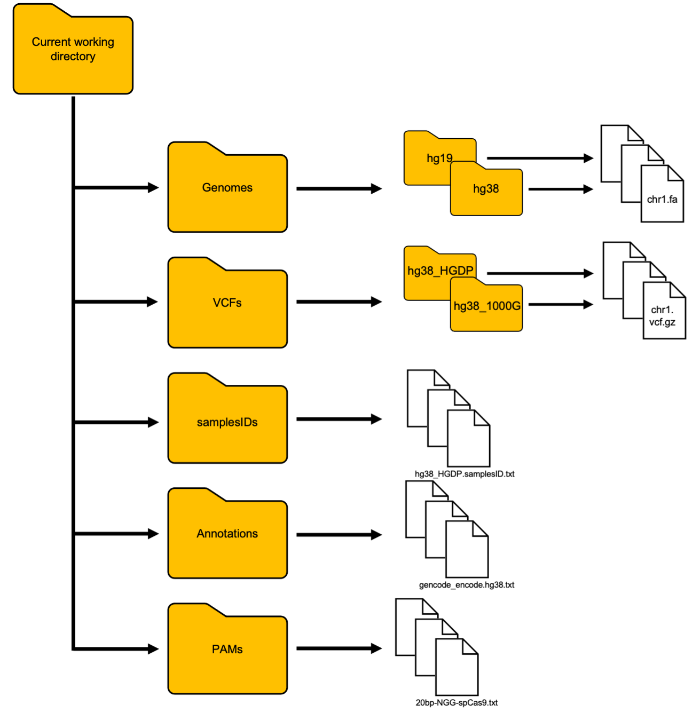

# CRISPRme

[](http://bioconda.github.io/recipes/crisprme/README.html)


CRISPRme is a comprehensive tool designed for thorough off-target assessment in 
CRISPR-Cas systems. Available as a web application 
([http://crisprme.di.univr.it/](http://crisprme.di.univr.it/)), offline tool, and 
command-line interface, it integrates human genetic variant datasets with orthogonal 
genomic annotations to predict and prioritize potential off-target sites at scale. 
CRISPRme accounts for single-nucleotide variants (SNVs) and indels, considers 
*bona fide* haplotypes, and allows for spacer:protospacer mismatches and bulges, 
making it well-suited for both population-wide and personal genome analyses. CRISPRme 
automates the entire workflow, from data download to executing the search, and delivers 
detailed reports complete with tables and figures through an interactive web-based 
interface.

## Table Of Contents

0 [System Requirements](#0-system-requirements)
<br>1 [Installation](#1-installation)
<br>&nbsp;&nbsp;1.1 [Install CRISPRme via Conda/Mamba](#11-install-crisprme-via-condamamba)
<br>&nbsp;&nbsp;&nbsp;&nbsp;1.1.1 [Installing Conda or Mamba](#111-installing-conda-or-mamba)
<br>&nbsp;&nbsp;&nbsp;&nbsp;1.1.2 [Installing CRISPRme](#112-installing-crisprme)
<br>&nbsp;&nbsp;&nbsp;&nbsp;1.1.3 [Updating CRISPRme](#113-updating-crisprme)
<br>&nbsp;&nbsp;1.2 [Install CRISPRme via Docker](#12-install-crisprme-via-docker)
<br>&nbsp;&nbsp;&nbsp;&nbsp;1.2.1 [Installing Docker](#121-installing-docker)
<br>&nbsp;&nbsp;&nbsp;&nbsp;1.2.2 [Building and Pulling CRISPRme Docker Image](#122-building-and-pulling-crisprme-docker-image)
<br>2 [Usage](#2-usage)
<br>&nbsp;&nbsp;2.1 [Directory Structure](#21-directory-structure)
<br>&nbsp;&nbsp;2.2 [CRISPRme Functions](#22-crisprme-functions)
<br>&nbsp;&nbsp;&nbsp;&nbsp; 2.2.1 [Complete Search](#221-complete-search)
<br>&nbsp;&nbsp;&nbsp;&nbsp; 2.2.4 [GNOMAD Converter](#224-gnomad-converter)
<br>&nbsp;&nbsp;&nbsp;&nbsp; 2.2.6 [Web Interface](#226-web-interface)

## 0 System Requirements

To ensure optimal performance, CRISPRme requires the following:

- **Minimum Memory (RAM)**: 32 GB
  <br>Suitable for typical use cases and smaller datasets.

- **Recommended Memory for Large Analyses**: 64 GB or more
  <br>Necessary for intensive operations such as whole-genome searches and
  processing large variant datasets.

For best results, confirm that your system meets or exceeds these specifications 
before running CRISPRme.

## 1 Installation

This section outlines the steps to install CRISPRme, tailored to suit different 
operating systems. Select the method that best matches your setup:

- [Install CRISPRme via Conda/Mamba (for Linux users)](#11-install-crisprme-via-condamamba)
  
- [Install CRISPRme via Docker (compatible with all operating systems)]()

Each method ensures a streamlined and efficient installation, enabling you to use 
CRISPRme with minimal effort. Follow the detailed instructions provided in the 
respective sections below.

### 1.1 Install CRISPRme via Conda/Mamba
---

This section is organized into three subsections to guide you through the installation 
and maintenance of CRISPRme:

- [Installing Conda or Mamba](#111-installing-conda-or-mamba):
  <br>This subsection provides step-by-step instructions to install either 
  Conda or Mamba. Begin here if you do not have these package managers installed 
  on your machine.

- [Installing CRISPRme](#112-installing-crisprme):
  <br>Once you have Conda or Mamba set up, proceed to this subsection for detailed 
  instructions on creating the CRISPRme environment and installing the necessary 
  dependencies.

- [Updating CRISPRme](#113-updating-crisprme):
  <br>Learn how to update an existing CRISPRme installation to the latest version, 
  ensuring access to new features and bug fixes.

#### 1.1.1 Installing Conda or Mamba
---

Before installing CRISPRme, ensure you have either Conda or Mamba installed on 
your machine. Based on recommendations from the Bioconda community, we highly 
recommend using Mamba over Conda. Mamba is a faster, more efficient drop-in replacement 
for Conda, leveraging a high-performance dependency solver and components 
optimized in C++.

**Step1: Install `Conda` or `Mamba`**

- To install `Conda`, refer to the official installation guide:
  <br>[Conda Installation Guide](https://docs.conda.io/projects/conda/en/latest/user-guide/install/index.html)

- To install `Mamba`, refer to the official installation guide: 
  <br>[Mamba Installation Guide](https://mamba.readthedocs.io/en/latest/installation/mamba-installation.html)

**Step 2: Configure Bioconda Channels**

Once `Mamba` is installed, configure it to use Bioconda and related channels by 
running the following one-time setup commands:
```bash
mamba config --add channels bioconda
mamba config --add channels defaults
mamba config --add channels conda-forge
mamba config --set channel_priority strict
```
> **Note:** If you prefer to use `Conda`, replace `mamba` with `conda` in the 
commands above

By completing these steps, your system will be fully prepared for installing CRISPRme.

#### 1.1.2 Installing CRISPRme
---

We strongly recommend using **`Mamba`** to create CRISPRme's `conda` environment 
due to its superior speed and reliability in dependency management. However, if 
you prefer `Conda`, you can replace `mamba` with `conda` in all the commands below.

**Step 1: Create CRISPRme's Environment**  

Open a terminal and execute the following command:  

```bash
mamba create -n crisprme python=3.9 crisprme -y  # Install CRISPRme and its dependencies
```  

This command sets up a dedicated `conda` environment named `crisprme`, installing 
CRISPRme along with all required dependencies.

**Step 2: Activate the Environment**  

To activate the newly created CRISPRme environment, type:  

```bash
mamba activate crisprme  # Enable the CRISPRme environment
```  

**Step 3: Test the Installation**  

To verify that CRISPRme is correctly installed, run the following commands in your terminal:  

```bash
crisprme.py --version  # Display the installed CRISPRme version
crisprme.py            # List CRISPRme functionalities
```  

- The first command will output the version of CRISPRme (e.g., `2.1.6`).  
- The second command should display CRISPRme's functionalities.  

If both commands execute successfully, your installation is complete, and 
CRISPRme is ready to use.

#### 1.1.3 Updating CRISPRme
---

To update an existing CRISPRme installation using `Mamba` or `Conda`, follow the 
steps below:

**Step 1: Check the Latest Version**

Visit the CRISPRme README to identify the latest version of the tool.

**Step 2: Update CRISPRme**

Run the following command in your terminal, replacing <latest_version> with the 
desired version number:
```bash
mamba install crisprme=<latest_version>  # Update CRISPRme to the specified version
```

For example, to update CRISPRme to version `2.1.6`, execute:
```bash
mamba install crisprme=2.1.6
```
If you're using `Conda`, replace `mamba` with `conda` in the commands above.

**Step 3: Verify the Update**

After the update completes, ensure the installation was successful by checking the 
version:
```bash
crisprme.py --version  # Confirm the installed version
```
If the displayed version matches the one you installed, the update was successful.

### 1.2 Install CRISPRme via Docker
---

This section is organized into two subsections to guide you through the setup of 
**CRISPRme** using Docker:  

- [Installing Docker](#121-installing-docker): 
<br>Provides step-by-step instructions for installing Docker on your system, 
ensuring compatibility with all operating systems, including Linux, macOS, and Windows.  

- [Building and Pulling CRISPRme Docker Image](#122-building-and-pulling-crisprme-docker-image): 
  <br>Explains how to create or download the CRISPRme Docker image to set up a 
  containerized environment for seamless execution.  

Follow the subsections in order if Docker is not yet installed on your machine. 
If Docker is already installed, skip to the second subsection.

#### 1.2.1 Installing Docker 
---

MacOS and Windows users are encouraged to install [Docker](https://www.docker.com/get-started) 
to use CRISPRme. Linux users may also choose Docker for convenience and compatibility.

Docker provides tailored distributions for different operating systems. Follow the 
official Docker installation guide specific to your OS:

- [MacOS Installation Guide](https://docs.docker.com/docker-for-mac/install/)
- [Windows Installation Guide](https://docs.docker.com/docker-for-windows/install/)
- [Linux Installation Guide](https://docs.docker.com/engine/install/ubuntu/)

**Linux-Specific Post-Installation Steps**

If you're using Linux, additional configuration steps are required:
1. Create the Docker Group:
  ```bash
  sudo groupadd docker
  ```

2. Add Your User to the Docker Group:
  ```bash
  sudo usermod -aG docker $USER
  ```
  Repeat this command for any additional users you want to include in the Docker 
  Group.

3. Restart Your Machine
  <br>Log out and log back in, or restart your machine to apply the changes.

**Testing Docker Installation**

Once Docker is installed, verify the setup by opening a terminal window and typing:
```bash
docker run hello-world
```

If Docker is installed correctly, you should see output like this:
```
Hello from Docker!
This message shows that your installation appears to be working correctly.

To generate this message, Docker took the following steps:
 1. The Docker client contacted the Docker daemon.
 2. The Docker daemon pulled the "hello-world" image from the Docker Hub.
 3. The Docker daemon created a new container from that image, which runs the executable that produces this output.
 4. The Docker daemon streamed this output to the Docker client, which displayed it on your terminal.

For more examples and ideas, visit:
 https://docs.docker.com/get-started/
```

#### 1.2.2 Building and Pulling CRISPRme Docker Image
---

After installing Docker, you can download and build the CRISPRme Docker image by 
running the following command in a terminal:
```bash
docker pull pinellolab/crisprme
```

This command retrieves the latest pre-built CRISPRme image from Docker Hub and sets 
it up on your system, ensuring all required dependencies and configurations are 
included.

Once the download is complete, the CRISPRme Docker image will be ready for use. 
To confirm the image is successfully installed, you can list all available Docker 
images by typing:
```bash
docker images
```

Look for an entry similar to the following:
```
REPOSITORY          TAG       IMAGE ID       CREATED        SIZE
pinellolab/crisprme latest    <image_id>     <timestamp>    <size>
```

You are now ready to run CRISPRme using Docker.

## 2 Usage

CRISPRme is a tool designed for variant- and haplotype-aware CRISPR off-target 
analysis. It integrates robust functionalities for off-target detection, 
variant-aware search, and result analysis. The tool also includes a 
user-friendly graphical interface, which can be deployed locally to streamline 
its usage.


### 2.1 Directory Structure
---

CRISPRme operates within a specific directory structure to manage input data and 
outputs efficiently. To ensure proper functionality, your working directory must 
include the following main subdirectories:

- **Genomes** 
    - **Purpose**: Stores reference genomes.
    - **Structure**: Each reference genome resides in its own subdirectory.
    - **Requirements**: The genome must be split into separate files, each 
    representing a single chromosome.

- **VCFs**
    - **Purpose**: Contains variant data in VCF format.
    - **Structure**: Similar to the Genomes directory, each dataset has a 
    dedicated subdirectory with VCF files split by chromosome.
    - **Requirements**: Files must be compressed using `bgzip` (with a `.gz`
    extension).

- **sampleIDs** 
    - **Purpose**: Lists the sample identifiers corresponding to the VCF 
    datasets.
    - **Structure**: Tab-separated files, one for each VCF dataset, specifying 
    the sample IDs.
    
- **Annotations** 
    - **Purpose**: Provides genome annotation data.
    - **Format**: Annotation files must be in BED format.

- **PAMs** 
    - **Purpose**: Specifies the Protospacer Adjacent Motif (PAM) sequences for 
    off-target search.
    - **Format**: Text files containing PAM sequences.

The directory organization required by CRISPRme is illustrated below:
<p align="center">
  
</p>

### 2.2 CRISPRme Functions
---

This section provides a comprehensive overview of CRISPRme's core functions, 
detailing each feature, the required input data and formats, and the resulting 
outputs. The following is a summary of CRISPRme's key features:

- [**Complete Search**](#221-complete-search) (`complete-search`)
  <br>Executes a genome-wide off-targets
  search across both reference and variant datasets (if specified), conducts 
  Cutting Frequency Determination (CFD) and CRISTA analyses (if applicable), and 
  identifies candidate targets.

- [**Complete Test**]() (`complete-test`)
  <br>Tests CRISPRme pipeline on a small input dataset or the full genome, 
  enabling users to validate the tool's functionality before performing 
  large-scale analyses.

- [**Targets Integration**]() (`targets-integration`) 
  <br>Combines *in silico* predicted targets with experimental data to create a 
  finalized target panel.

- [**GNOMAD Converter**](#224-gnomad-converter) (`gnomAD-converter`) 
  <br>Transforms GNOMAD VCFs (`vcf.bgz` format) into a format compatible with 
  CRISPRme. The function supports VCFs from GNOMAD v3.1, v4.0, and v4.1, 
  including *joint* VCFs.

- [**Generate Personal Card**]() (`generate-personal-card`) 
  <br>Generates a personalized summary for a specific sample, identifying all 
  private off-targets unique to that individual.

- [**Web Interface**](#226-web-interface) (`web-interface`)
  <br>Launches CRISPRme's interactive web interface, allowing users to manage 
  and execute tasks directly via a local browser.

#### 2.2.1 Complete Search
---

The **Complete Search** function performs an exhaustive variant- and 
haplotype-aware off-target analysis, leveraging the provided reference genome 
and variant datasets to deliver comprehensive results. This feature integrates 
all critical stages of the CRISPRme pipeline, encompassing off-target 
identification, functional annotation, and detailed reporting.

Key highlights of the Complete Search functionality include:

- **Variant- and Haplotype-Awareness** 
  <br>Accurately incorporates genetic variation, including population- and 
  sample-specific variants, and haplotypes data, to identify off-targets that 
  reflect real-world genomic diversity.

- **Comprehensive Off-Target Discovery**
  <br>Searches both the reference genome and user-specified variant datasets 
  for potential off-targets, including those encompassing mismatches and bulges.

- **Functional Annotation** 
  <br>Annotates off-targets with relevant genomic features, such as 
  coding/non-coding regions, regulatory elements, and gene proximity.

- **Detailed Reporting**
  <br>Generates population-specific and sample-specific off-target summaries, 
  highlighting variations that may impact specificity or introduce novel PAM 
  sites. Provides CFD (Cutting Frequency Determination) and CRISTA scores, and 
  mismatches and bulges counts to rank off-targets based on their potential 
  impact. Includes graphical representations of findings to facilitate result 
  interpretation.

- **Output Formats** 
  <br>Produces user-friendly output files, including text-based tables and 
  visualization-ready graphical summaries.

Usage Example for the Complete Search function:
- **Via Conda/Mamba**
  ```bash
  crisprme.py complete-search \
  --genome Genomes/hg38 \  # reference genome directory
  --vcf vcf_config.1000G.HGDP.txt \  # config file declaring usage of 1000G and HGDP variant datasets
  --guide sg1617.txt \  # guide 
  --pam PAMs/20bp-NGG-spCas9.txt \  # NGG PAM file
  --annotation Annotations/dhs+gencode+encode.hg38.bed \  # annotation BED
  --gene_annotation Annotations/gencode.protein_coding.bed \  # gene proximity annotation BED
  --samplesID samplesIDs.1000G.HGDP.txt \  # config file declaring usage of 1000G and HGDP samples
  --be-window 4,8 \  # base editing window start and stop positions within off-targets
  --be-base A,G \  # nucleotide to test base editing potential (A>G)
  --mm 6 \  # number of max mismatches
  --bDNA 2 \  # number of max DNA bulges
  --bRNA 2 \  # number of max RNA bulges
  --merge 3 \  # merge off-targets mapped within 3 bp in clusters
  --sorting-criteria-scoring mm+bulges \  # prioritize within each cluster off-targets with highest score and lowest mm+bulges (CFD and CRISTA reports only)
  --sorting-criteria mm,bulges \  # prioritize within each cluster off-targets with lowest mm and bulges counts
  --output sg1617-NGG-1000G-HGDP \  # output directory name
  --thread 8  # number of threads 
  ```

- **Via Docker**
  ```bash
  docker run -v ${PWD}:/DATA -w /DATA -i pinellolab/crisprme \
    crisprme.py complete-search \
    --genome Genomes/hg38 \  # reference genome directory
    --vcf vcf_config.1000G.HGDP.txt \  # config file declaring usage of 1000G and HGDP variant datasets
    --guide sg1617.txt \  # guide 
    --pam PAMs/20bp-NGG-spCas9.txt \  # NGG PAM file
    --annotation Annotations/dhs+gencode+encode.hg38.bed \  # annotation BED
    --gene_annotation Annotations/gencode.protein_coding.bed \  # gene proximity annotation BED
    --samplesID samplesIDs.1000G.HGDP.txt \  # config file declaring usage of 1000G and HGDP samples
    --be-window 4,8 \  # base editing window start and stop positions within off-targets
    --be-base A,G \  # nucleotide to test base editing potential (A>G)
    --mm 6 \  # number of max mismatches
    --bDNA 2 \  # number of max DNA bulges
    --bRNA 2 \  # number of max RNA bulges
    --merge 3 \  # merge off-targets mapped within 3 bp in clusters
    --sorting-criteria-scoring mm+bulges \  # prioritize within each cluster off-targets with highest score and lowest mm+bulges (CFD and CRISTA reports only)
    --sorting-criteria mm,bulges \  # prioritize within each cluster off-targets with lowest mm and bulges counts
    --output sg1617-NGG-1000G-HGDP \  # output directory name
    --thread 8  # number of threads 
  ```

##### Input Arguments
---

Below is a detailed list of the input arguments required or optionally used by 
the Complete Search function. Each parameter is explained to ensure clarity in 
its purpose and usage:

**General Parameters**
- `--help`
  <br>Displays the help message with usage details and exits. Useful for quickly 
  referencing all available options.

- `--output` (*Required*)
  <br>Specifies the name of the output directory where all results from the 
  analysis will be saved. This directory will be created within the `Results` 
  directory.

- `--thread` (*Optional - Default: 4*)
  <br>Defines the number of CPU threads to use for parallel computation. 
  Increasing the number of threads can speed up analysis on systems with 
  multiple cores.

- `--debug` (*Optional*)
  <br>Runs the tool in debug mode. 

**Input Data Parameters** 

- `--genome` (*Required*)
  <br>Path to the directory containing the reference genome in FASTA format. 
  Each chromosome must be in a separate file (e.g., `chr1.fa`, `chr2.fa`, etc.). 

- `--vcf` (*Optional*)
  <br>Path to text config file listing the directories containing VCF files to 
  be integrated into the analysis. When provided, CRISPRme conducts variant- 
  and haplotype-aware searches. If not specified, the tool searches only on the 
  reference genome. 

- `--guide` 
  <br>Path to a text file containing one or more guide RNA sequences (one per 
  line) to search for in the input genome and variants. This argument cannot be
  used together with `--sequence`.

- `--sequence`
  <br>Path to a FASTA file listing guide RNA sequences. This argument is an 
  alternative to `--guide` and cannot be used simultaneously.

- `--pam` (*Required*)
  <br>Path to a text file specifying the PAM sequence(s) required for the 
  search. The file should define the PAM format (e.g., `NGG` for SpCas9).

**Annotation Parameters (*Optional*)**

- `--annotation`
  <br>Path to a BED file containing genomic annotations, such as regulatory 
  regions (e.g., DNase hypersensitive sites, enhancers, promoters). These 
  annotations provide functional context for identified off-targets.

- `--gene_annotation`
  <br>Path to a BED file containing gene information, such as Gencode 
  protein-coding annotations. This is used to calculate the proximity of 
  off-targets to genes for downstream analyses.

**Base Editing Parameters (*Optional*)**

- `--be-window`
  <br>Specifies the editing window for base editors, defined as start and stop 
  positions relative to the guide RNA (1-based, comma-separated). This defines 
  the region of interest for base-editing analysis.

- `--be-base`
  <br>Defines the target nucleotide(s) for base editing. This is only used when 
  base editing functionality is needed.

**Sample-Specific Parameters (*Optional*)**

- `--samplesID` 
  <br>Path to a text config file listing sample identifiers (one per line)
  corresponding to VCF datasets. This enables sample-specific off-target 
  analyses. Mandatory if `--vcf` is specified.

**Search and Merging Parameters**

- `--mm` (*Required*)
  <br>Maximum number of mismatches allowed during off-target identification.

- `--bDNA` (*Required*)
  <br>Maximum allowable DNA bulge size.

- `--bRNA` (*Required*)
  <br>Maximum allowable RNA bulge size.

- `--merge` (*Optional - Default: 3*)
  <br>Defines the window size (in base pairs) used to merge closely spaced 
  off-targets. Pivot targets are selected based on the highest score (e.g., 
  CFD, CRISTA) or criteria defined by the `--sorting-criteria`. 

- `--sorting-criteria-scoring` (*Optional - Default: `mm+bulges`*)
  <br>Specifies sorting criteria for merging when using CFD/CRISTA scores. 
  Options include:
    - mm: Number of mismatches.
    - bulges: Total bulge size.
    - mm+bulges: Combined mismatches and bulges. 

- `--sorting-criteria` (*Optional - Default: `mm+bulges,mm`*)
  <br>Sorting criteria used when CFD/CRISTA scores are unavailable. Options are 
  similar to `--sorting-criteria-scoring` but tailored for simpler analyses. 

**Note 1**: Ensure compatibility between input files and genome builds (e.g., 
hg38 or hg19) to avoid alignment issues.

**Note 2**: Optional arguments can be omitted when not applicable, but required 
arguments must always be specified.

##### Output Data Overview
---

The Complete Search function generates a comprehensive suite of reports, 
detailing the identified and prioritized targets, along with statistical and 
graphical summaries. These outputs are essential for interpreting the search 
results and understanding the impact of genetic diversity on CRISPR off-target.

**Output Off-targets Files Description**

1. `*.integrated_results.tsv`
    
    - **Contents**: A detailed file containing the top targets (`*.bestMerge.txt`) 
    enriched with annotations from the input files. Includes:
        - Gene proximity of off-targets
        - Overlaps with regulatory elements
    
    - **Purpose**: Integrates functional genomic context into the prioritization 
    of off-targets.

2. `*.all_results_with_alternative_alignments.tsv` 
    
    - **Contents**: Comprehensive listing of all identified targets, including 
    alternative alignments. Annotated with:
        - Gene proximity
        - Overlaps with regulatory elements
    
    - **Purpose**: Facilitates a full exploration of CRISPRme's off-target 
    predictions and their functional relevance.

**Guide-Specific Summary Files**

These files summarize off-target statistics per guide sequence based on 
different sorting criteria.
    
3. `*.summary_by_guide.<guide-sequence>_CFD.txt` 
    
    - **Contents**: Summarizes off-target counts per guide using the CFD score
    as the primary sorting criterion (data derived from 
    `*.integrated_results.tsv`). Includes counts of:
        - Targets by bulge type (DNA, RNA).
        - Mismatch number and bulge size.
        - Targets in the reference genome, variant genome, and those caused by 
        PAM creation due to variants.

    - **Purpose**: Provides insight into the distribution and characteristics of 
    off-targets prioritized by CFD score.
    
4. `*.summary_by_guide.<guide-sequence>_CRISTA.txt`

    - **Contents**: Summarizes off-target counts per guide using the CRISTA score
    as the primary sorting criterion (data derived from 
    `*.integrated_results.tsv`). Includes counts of:
        - Targets by bulge type (DNA, RNA).
        - Mismatch number and bulge size.
        - Targets in the reference genome, variant genome, and those caused by 
        PAM creation due to variants.

    - **Purpose**: Provides insight into the distribution and characteristics of 
    off-targets prioritized by CRISTA score.

5. `*.summary_by_guide.<guide-sequence>_fewest.txt`

    - **Contents**: Summarizes off-target counts per guide using the fewest 
    mismatches and bulges as the sorting criterion.

    - **Purpose**: Highlights off-targets that are closest to perfect matches, 
    providing an alternative prioritization method.

**Sample-Specific Summary Files**

These files focus on off-targets unique to individual samples and their 
populations.

6. `*.summary_by_samples.<guide-sequence>_CFD.txt`

    - **Contents**: Counts of private off-targets per sample, sorted by CFD 
    score. Reports targets:
        - Private to the sample.
        - Found in the population or superpopulation.
        - Resulting from PAM creation due to a variant.

    - **Purpose**: Quantifies sample-specific off-targets and their broader 
    population impact.

7. `*.summary_by_samples.<guide-sequence>_CRISTA.txt`
    
    - **Contents**: Similar to the CFD-based sample summary but uses CRISTA 
    score for sorting.

8. `*.summary_by_samples.<guide-sequence>_fewest.txt`
    - **Contents**: Summarizes private off-targets using the fewest mismatches 
    and bulges as the sorting criterion.

**Graphical Output**

9. `imgs` directory 

    - **Contents**: Contains visual representations of the top 1000 targets 
      based on CFD score, CRISTA score, and Fewest mismatches and bulges. Images 
      include:
        - Bar plots showing the distribution of targets across populations and 
        bulge types.
        - Graphical summaries illustrating the impact of genetic variants on 
        mismatches, bulge size, and scores.

    - **Purpose**: Facilitates easy interpretation and presentation of CRISPRme 
    results.

#### Complete-test

The `complete-test` feature offers a fully automated pipeline for testing CRISPRme's installation. It handles the creation of the CRISPRme directory structure and downloads the essential files required to run the tool. `Complete-test` provides several testing options, allowing the user to perform quick tests on a single chromosome or conduct comprehensive tests on the entire genome. Furthermore, the feature supports testing CRISPRme using either the 1000 Genomes Phase 3 dataset or the Human Genome Diversity Project (HGDP) dataset. The testing environment can be configured by the user via command line parameters.

The necessary data for these tests can be accessed [here](https://github.com/pinellolab/CRISPRme/tree/gnomad-4.1-converter/test/data), except for the FASTA and VCF files, which are downloaded from the UCSC and 1000 Genomes/HGDP databases due to their large file sizes.

##### Input arguments

Below the list and description of the input arguments required by `complete-test` function:

- **--help**: Displays the help message and exits.

- **--chrom**: Specifies the chromosome for CRISPRme's test. The chromosome number must be prefixed with chr (e.g., chr22). By default, the test is conducted on the entire genome. [OPTIONAL]

- **--vcf_dataset**: Defines the variant dataset used for testing CRISPRme. The available options are `1000G` for the 1000 Genomes dataset and `HGDP` for the Human Genome Diversity Project dataset. The default dataset is 1000 Genomes. [OPTIONAL]

- **--debug**: Runs the tool in debug mode. [OPTIONAL]

##### Output data


##### Usage example

Usage example of `complete-test` function:

- Via `conda`/`mamba`:
```
# test only on chr 22 and 1000 Genomes
crisprme.py complete-test --chrom chr22 --vcf_dataset 1000G

# test on the entire genome and HGDP 
crisprme.py complete-test --vcf_dataset HGDP

# test on the entire genome and 1000G+HGDP
crisprme.py complete-test --vcf_dataset 1000G+HGDP
```

- Via `Docker`:
```
# test only on chr 22 and 1000 Genomes
docker run -v ${PWD}:/DATA -w /DATA -i pinellolab/crisprme crisprme.py complete-test --chrom chr22 --vcf_dataset 1000G

# test on the entire genome and HGDP 
docker run -v ${PWD}:/DATA -w /DATA -i pinellolab/crisprme crisprme.py complete-test --vcf_dataset HGDP

# test on the entire genome and 1000G+HGDP
docker run -v ${PWD}:/DATA -w /DATA -i pinellolab/crisprme
crisprme.py complete-test --vcf_dataset 1000G+HGDP
```

#### Targets-integration

The `targets-integration` feature combines the targets identified by CRISPRme with empirically validated targets, such as those obtained through GUIDE-seq or CIRCLE-seq. The empirically validated targets should be provided in a `BED` file. After integrating the two datasets, this feature generates an `integrated_result` file within the specified output directory.

##### Input arguments

Below the list and description of the input arguments required by `targets-integration` function:

- **--help**: Displays the help message and exits.

- **--targets**: File containing the targets identified and processed from a CRISPRme search.

- **--empirical_data**: `BED` file with empirically verified off-targets, such as those obtained from GUIDE-seq, CIRCLE-seq, or other sequencing protocols.

- **--output**: NName of the output directory where the integrated targets file will be saved.

- **--debug**: Runs the tool in debug mode. [OPTIONAL]

##### Output data

##### Usage example

Usage example of `targets-integration` function:

- Via `conda`/`mamba`:
  ```
  crisprme.py targets-integration --targets results.integrated_results.tsv --empirical_data empirical_data.bed --output integrated_targets_dir
  ```

- Via `Docker`:
  ```
  docker run -v ${PWD}:/DATA -w /DATA -i i pinellolab/crisprme crisprme.py targets-integration --targets results.integrated_results.tsv --empirical_data empirical_data.bed --output integrated_targets_dir
  ```

#### 2.2.4 GNOMAD Converter
--- 

The **GNOMAD Converter** function is a utility designed to preprocess and 
convert GNOMAD VCF files into a format compatible with CRISPRme for off-target 
analysis. This tool facilitates the inclusion of population-level genetic 
variation data from GNOMAD into CRISPRme.

The converter currently supports VCF files from the following GNOMAD versions:
- **v3.1**
- **v4.0**
- **v4.1**, including joint VCF files (exomes + genomes).

Since individual sample data are not available in GNOMAD VCFs, the tool relies 
on population-level groupings. Populations are treated as individual "samples" 
for the purpose of conversion. This approach supports population-based 
statistical analyses in CRISPRme, such as identifying population-specific 
off-targets.

**Note 1**: For studies requiring sample-specific statistics, GNOMAD is not 
recommended due to its population-level nature.

**Note 2**: The GNOMAD Converter function is particularly useful for creating 
GNOMAD-compatible datasets formatted for CRISPRme's population-aware off-target 
analysis.

**Note 3**: Since GNOMAD provides population-level data rather than 
individual-level data, CRISPRme interprets populations as pseudo-individuals. 
This approach allows meaningful population-level statistics but is not suitable 
for applications requiring individual-level granularity.

To ensure a smooth conversion process, sample ID files compatible with GNOMAD 
VCFs must be provided. These files are available for download from the CRISPRme 
GitHub repository:

- [Sample IDs file for GNOMAD v3.1 and v4.0](https://github.com/pinellolab/CRISPRme/blob/v216/test/data/samplesIDs.gnomad.v40.txt)

- [Sample IDs file for GNOMAD v4.1](https://github.com/pinellolab/CRISPRme/blob/v216/test/data/samplesIDs.gnomad.v41.txt)

The conversion process preserves all variant information necessary for CRISPRme
analyses, including allele frequencies and genotypes (if applicable).

Usage Example for the GNOMAD Converter function:
- **Via Conda/Mamba**
  ```bash
  crisprme.py gnomAD-converter \
    --gnomAD_VCFdir gnomad_vcf_dir \  # directory containing GNOMAD VCFs
    --samplesID samplesIDs.gnomad.v41.txt \  # GNOMAD v4.1 samples file
    --keep \  # keep variants with filter different from PASS
    --thread 4  # number of threads
  ```

- **Via Docker**
  ```bash
  docker run -v ${PWD}:/DATA -w /DATA -i pinellolab/crisprme \
    crisprme.py gnomAD-converter \
    --gnomAD_VCFdir gnomad_vcf_dir \  # directory containing GNOMAD VCFs
    --samplesID samplesIDs.gnomad.v41.txt \  # GNOMAD v4.1 samples file
    --keep \  # keep variants with filter different from PASS
    --thread 4  # number of threads
  ```

##### Input Arguments
---

Below is a detailed list of the input arguments required by the GNOMAD Converter 
function, including detailed explanations and default behaviors:

**General Parameters**

- `--help`
  <br>Displays the help message with details about the available options and 
  exits the program.

- `--thread` (*Optional - Default: 4*)
  <br>Specifies the number of threads to use for the computation, allowing for 
  parallel processing.

- `--debug` (*Optional*)
  <br>Runs the tool in debug mode. 

**Input Data Parameters**

- `--gnomAD_VCFdir` (*Required*)
  <br>Specifies the directory containing the gnomAD VCF files to be processed 
  and converted into a format compatible with CRISPRme.

- `--samplesID` (*Required*)
  <br>Path to a text file containing the sample IDs used during the conversion 
  process. In this file, GNOMAD populations are treated as pseudo-individual 
  samples to create population-based VCFs for CRISPRme.

- `--joint` (*Optional*)
  <br>Use this flag if GNOMAD VCFs being processed are joint VCFs, such as 
  GNOMAD v4.1 joint variant files. *Default Behavior*: Assumes the input VCFs 
  are not joint.

- `--keep` (*Optional*)
  <br>Use this flag to retain all variants during the conversion, regardless of
  the FILTER field value. *Default behavior*: Excludes variants that do not have 
  a `PASS` value in the FILTER field.

- `--multiallelic` (*Optional*)
  <br>Indicates whether to merge variants at the same genomic position into a 
  single multiallelic record. *Default behavior*: Keeps variants as biallelic 
  and does not merge them.

##### Output Data Overview
---

The output of the GNOMAD Converter function consists of converted VCF files 
formatted to be compatible with CRISPRme. These files are stored in the same 
directory as the input VCF files. The conversion process ensures that the output 
adheres to CRISPRme's input specifications for population-level analysis. Below 
are details about the generated data:

**File Naming Conventions**

- **Multiallelic Variant Merging** (`--multiallelic`)
  <br>If multiallelic entries were generated by merging variants at the same 
  position, the filename will include a tag such as `*.multiallelic.*`, 
  `*.biallelic.*` otherwise.

- **Joint Variant Files** (`--joint`)
  <br>If joint VCFs were processed, the filenames will be labeled accordingly, 
  for example, `*.joint.*`.

**Content of the Converted VCFs**

- **Population Representation**
  <br>Each output VCF treats GNOMAD populations as pseudo-individual samples, 
  enabling CRISPRme to perform population-based statistical analysis. This 
  structure is reflected in the sample columns of the output VCFs.

- **Variant Quality**
  <br>If the `--keep` flag is used, all variants from the input VCF are included,
  regardless of their quality as indicated in the FILTER field. Without the 
  `--keep` flag, only variants with a `PASS` in the FILTER field are retained.

- **Allele Representation**
  <br>By default, the converter preserves biallelic representation, creating one 
  row per variant. If the `--multiallelic` flag is used, variants at the same 
  position are merged into multiallelic entries.

- **Compatible Structure**
  <br>The output files are structured to align with CRISPRme's population-aware 
  off-target analysis, ensuring seamless integration into the tool's pipeline.


#### Generate-personal-card

The `generate-personal-card` functionality generates a sample-specific report. This report, called personal card, contains all targets found by CRISPRme on the sample-specific genomic sequence, accounting for its private variants. This functionality is useful when searching private potential off-target sequences for a certain input guide.

##### Input arguments 

Below the list and description of the input arguments required by `generate-personal-card` function:

- **--help**: Displays the help message and exits.

- **--result_dir**: Directory containing the CRISPRme search results. Targets are extracted from the targets reports available in the input directory.

- **--guide_seq**: sequence of the guide of interest to use to extract the sample-specific targets from the input data

- **--sample_id**: ID of the sample to use to generate the personal card

- **--debug**: Runs the tool in debug mode.

##### Output data
- Set of plots generated with personal and private targets containing the variant CFD score and the reference CFD score
- Filtered file with private targets of the sample directly extracted from integrated file

##### Usage example

Usage example of `generate-personal-card` function:

- Via `conda`/`mamba`:
  ```
  crisprme.py generate-personal-card --result_dir Results/sg1617.6.2.2 --guide_seq CTAACAGTTGCTTTTATCACNNN --sample_id NA21129
  ```

- Via `Docker`:
  ```
  docker run -v ${PWD}:/DATA -w /DATA -i i pinellolab/crisprme crisprme.py generate-personal-card --result_dir Results/sg1617.6.2.2/ --guide_seq CTAACAGTTGCTTTTATCACNNN --sample_id NA21129
  ```

#### 2.2.6 Web Interface
---

The **Web Interface** module offers a user-friendly, locally hosted graphical 
user interface (GUI) for CRISPRme. This feature replicates the functionality of 
CRISPRme's online platform, enabling users to execute CRISPRme workflows and 
explore search results interactively without requiring an internet connection.

The GUI allows users to submit CRISPRme jobs directly through the web interface. 
Users can upload input files, configure parameters, and monitor progress with 
ease.

The interface provides an intuitive way to explore the output files generated by 
CRISPRme. Users can filter targets by criteria such as mismatch count, bulge 
size, or scores (e.g., CFD or CRISTA). The interface includes dynamic plots and 
charts. Results are presented in a structured, easy-to-navigate format, linking 
data to relevant genomic annotations. The web interface runs as a local server, 
ensuring data privacy and fast response times. Users can access it via their 
preferred web browser, with compatibility confirmed for: Google Chrome, Mozilla 
Firefox, and Safari. All functionalities are self-contained, eliminating the 
need for an internet connection. This is particularly useful for secure
environments or systems without reliable internet access.

Usage example for the Web Interface function:

- **Via Conda/Mamba**
  ```bash
  crisprme.py web-interface  # Starts the local server and launches the web interface
  ```

- **Via Docker**
  ```bash
  docker run -v ${PWD}:/DATA -w /DATA -i pinellolab/crisprme \
    crisprme.py web-interface  # Starts the local server and launches the web interface
  ```

##### Input arguments
---

Below is a detailed list of the input arguments required by the Web Interface 
function:

- `--help`
  <br>Displays the help message and exits.

- `--debug`
  <br>Launches the local server in debug mode. This mode enables verbose logging, 
  which is useful for troubleshooting and diagnosing issues during setup or 
  operation. It provides detailed error messages and runtime information in the 
  console.

##### Output data
---

This function does not generate output data in the form of files or reports. 
Instead, it serves to launch a local graphical user interface, which allows 
users to interactively explore and run CRISPRme analyses. All results are 
displayed dynamically within the web interface itself, offering an interactive 
experience for viewing CRISPRme data and outputs (see [Section 2.2.1](#221-complete-search)
for details).


## Test

To quickly verify the installation of CRISPRme, open a new terminal window and run the following command:

- Via `Conda`/`Mamba`:
```
crisprme.py --version  # v2.1.6
```

- Via `Docker`:
```
docker run -v ${PWD}:/DATA -w /DATA -i i pinellolab/crisprme crisprme.py --version  # v2.1.6
```

If the command returns the correct software version, CRISPRme has been successfully installed and is ready for use.

For a more detailed test, testing the main CRISPRme's functionality (`complete-search`), CRISPRme provides a dedicated [functionality](#complete-test). The test functionality provides two main test options, one quicker the other more detailed. The quicker test mode, performs an off-target search on a single chromosome sequence enriched with variants from either 1000 Genomes or Human Genome Diversity Project datasets. The more detailed test, instead, test crisprme searching potential off-targets across the entire genome. The test on the full genome replicates the analysis presented in our [paper](#citation), using the sg1617 single uguide RNA, `NGG` PAM, and the gencode and encode annotations.

To run the test on a single chromosome (chromosome 22) and using 1000 Genomes variants, open a new terminal window and run the following command:

- Via `Conda`/`Mamba`
```
crisprme.py complete-test --chrom chr22 --vcf_dataset 1000G
```

- Via `Docker`:
```
docker run -v ${PWD}:/DATA -w /DATA -i i pinellolab/crisprme crisprme.py complete-test --chrom 22 --vcf_dataset 1000G
```

To run the test on the entire genome and using 1000 Genomes variants, open a new terminal window and run the following command:

- Via `Conda`/`Mamba`
```
crisprme.py complete-test --vcf_dataset 1000G
```

- Via `Docker`:
```
docker run -v ${PWD}:/DATA -w /DATA -i i pinellolab/crisprme crisprme.py complete-test --vcf_dataset 1000G
```

## Citation
If you use CRISPRme in your research, please cite our [paper](https://rdcu.be/c1GYQ):

Cancellieri S, Zeng J, Lin LY, Tognon M, Nguyen MA, Lin J, Bombieri N, Maitland SA, Ciuculescu MF, Katta V, Tsai SQ, Armant M, Wolfe SA, Giugno R, Bauer DE, Pinello L. Human genetic diversity alters off-target outcomes of therapeutic gene editing. Nat Genet. 2023 Jan;55(1):34-43. doi: [10.1038/s41588-022-01257-y](https://doi.org/10.1038/s41588-022-01257-y). Epub 2022 Dec 15. PMID: 36522432; PMCID: PMC10272994.

## Contacts

Luca Pinello: lpinello@mgh.harvard.edu<br>
Rosalba Giugno: rosalba.giugno@univr.it<br>
Daniel Bauer: bauer@bloodgroup.tch.harvard.edu

## License

CRISPRme is licensed under AGPL-3.0, allowing use for academic research only.

For-profit institutions must purchase a license before using CRISPRme. For more information, please contact lpinello@mgh.harvard.edu.
