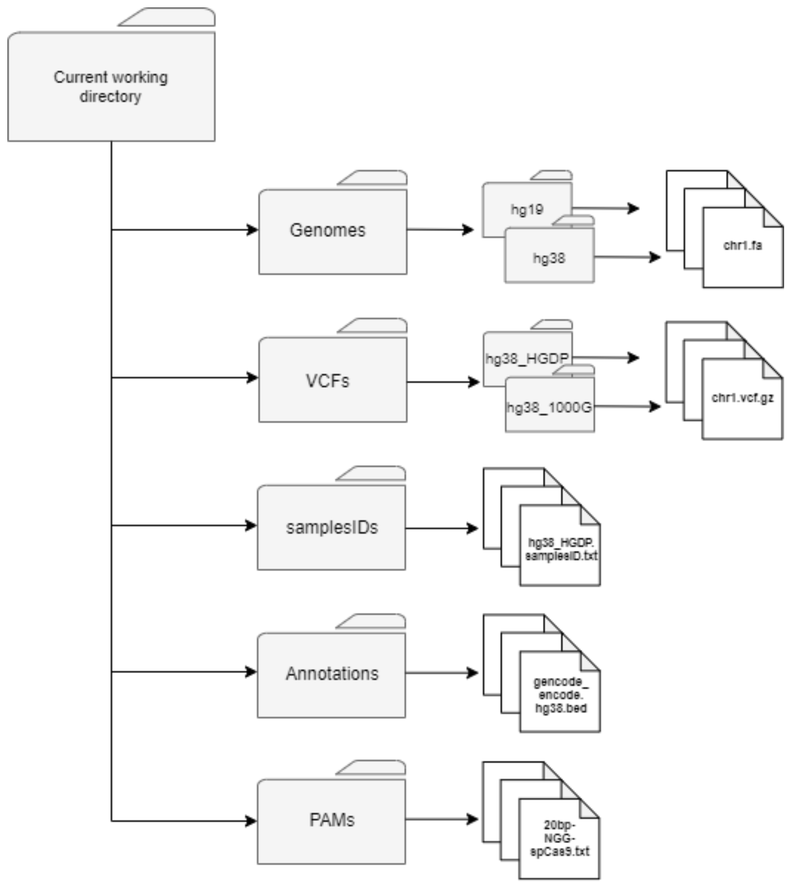

# CRISPRme

[](http://bioconda.github.io/recipes/crisprme/README.html)


CRISPRme is a tool for comprehensive off-target assessment available as a web application [online](http://crisprme.di.univr.it/), offline, and command line. It integrates human genetic variant datasets with orthogonal genomic annotations to predict and prioritize CRISPR-Cas off-target sites at scale. The method considers both single-nucleotide variants (SNVs) and indels, accounts for bona fide haplotypes, accepts spacer:protospacer mismatches and bulges, and is suitable for population and personal genome analyses. CRISPRme takes care of all steps in the process including data download, executing the complete search, and presents an exhaustive report with tables and figures within interactive web-based GUI.

The software has the following main functionalities:

- ```complete-search``` performs a search from scratch with the given inputs (including gRNA, reference genome, and genetic variants).
- ```targets-integration``` integrates the search results with GENCODE data to identify genes close to the candidate off-targets and collect the top ranking candidates in term of CFD score, CRISTA score, or number of mismatches/bulges.
- ```web-interface``` starts a local instance of the web interface accessible from any browser.

## Installation

CRISPRme can be installed both via **Conda** (only Linux users) and **Docker** (all operating systems, including OSX and Windows).

### Installation via Conda

If conda is not already available on your machine, the next section will describe how to obtain a fresh ```conda``` distribution. If ```conda``` is already available on your machine you can skip the next section and go to **Create CRISPRme conda environment** section.

#### Obtaining a fresh conda distribution
If conda is not already available in your environment you can get a fresh ```miniconda``` distribution. To obtain a fresh ```miniconda``` distribution, open a new terminal window and type:
```
curl https://repo.anaconda.com/miniconda/Miniconda3-latest-Linux-x86_64
bash Miniconda3-latest-Linux-x86_64.sh
```
Press ENTER when requested and answer ```yes``` when required. Conda will set all the directories in your ```HOME``` path for an easy use.

Close the current terminal window and reopen it to allow the system to start ```conda```. If you see in the new window something similar to
```
(base) user@nameofPC:~$
```
```conda``` was correctly installed and it is ready to run.

The next step, will be a one-time set up of ```conda``` channels. To set up the channels type on your terminal:
```
conda config --add channels defaults
conda config --add channels bioconda
conda config --add channels conda-forge
```

#### Create CRISPRme conda environment
To create the ```conda``` environment for CRISPRme, it is suggested to use ```mamba```. ```mamba``` is a drop-in replacement for conda that uses a faster dependency solving library and parts reimplemented in C++ for speed. To install ```mamba```, in your terminal window type:
```
conda install mamba -n base -c conda-forge
```

Once installed ```mamba```, you are ready to build the CRISPRme environmet. To build the environment, type:
```
mamba create -n crisprme python=3.9.19 crisprme -y
```

To activate the environmment, type:
```
conda activate crisprme
```

To test the installation, type in your terminal window:
```
crisprme.py
```

If you see all CRISPRme's functionalities listed, you succesfully installed CRISPRme on your machine, and it is ready to be used on your machine.

#### Updating CRISPRme conda installation
If you want to update an older CRISPRme installation to the latest version, we suggest updating as:
```
mamba install crisprme==<latest_version>
```
For example:
```
mamba install crisprme==2.1.5
```
You can find the latest release indicated at the top of our [README](https://github.com/pinellolab/CRISPRme#crisprme).

## Installation via Docker
For OSX and Windows users is suggested to run CRISPRme via [Docker](https://www.docker.com/get-started). Follow the following links to install Docker on [OSX](https://docs.docker.com/docker-for-mac/install/) or [Windows](https://docs.docker.com/docker-for-windows/install/), and follow the on-screen instructions.

If you plan to use CRISPRme via Docker on a Linux-based OS read and follow the instructions listed in the next section, skip it otherwise.

### Install CRISPRme using Docker
We assume you have already installed Docker on your system. Open a new terminal window and type:
```
docker pull pinellolab/crisprme
```
This command will download and install CRISPRme Docker image on your machine.

## Test CRISPRme
To test your CRISPRme installation, open a new terminal window and type:
```
mkdir crisprme_test && cd crisprme_test
wget https://raw.githubusercontent.com/pinellolab/CRISPRme/refs/heads/main/crisprme_auto_test_conda.sh
 
```
This will download a script to download all the data necessary to run a full test using a single gRNA.

Once downloaded, enter the folder by typing:

If you installed CRISPRme via ```conda```, test your conda installation by typing:
```
bash crisprme_auto_test_conda.sh
```

Otherwise, if you installed CRISPRme via Docker, test your Docker installation by typing:
```
bash crisprme_auto_test_docker.sh
```

After starting, the tests will download the required test data, then CRISPRme will start its analysis.
**NB** Depending on your hardware the test may take very different time to complete.

Once downloaded and untared the folder, you will have a ready to use CRISPRme directory tree.
**NB  DO NOT CHANGE ANY FOLDER NAME** to avoid losing data or forcing to recompute indexes and dictionaries. **YOU MUST USE THE DEFAULT FOLDERS TO STORE THE DATA** since the software have been designed to recognize only files and folders in its own folder tree (see **Usage** section).


## Usage
CRISPRme is designed to work and recognize its specific directories tree structure. See the following image for a detailed explanantion of CRISPRme's folders structure


<br>**CAVEAT.** Before running CRISPRme make sure that your system has **>= 64 GB of memory** available.

The following sections will describe the main functionalities of CRISPRme, listing their input data, and the expected output.

#### Complete-search function
```complete-search``` performs a complete search from scratch returing all the results and post-analysis data.

**Input**:
- Directory containing a reference genome (FASTA format). The reference genome must be separated into single chromosome files (e.g. chr1.fa, chr2.fa, etc.).
- Text file storing path to the VCF directories [OPTIONAL]
- Text file with a list of guides (1 to N)
- Text file with a single PAM sequence
- BED file with annotations, containing a list of genetic regions with a function associated
- Text file containing a list of path to a samplesID file (1 to N) equal to the number of VCF dataset used [OPTIONAL]
- Base editor window, used to specify the window to search for susceptibilty to certain base editor [OPTIONAL]
- Base editor nucleotide(s), used to specify the base(s) to check for the choosen editor [OPTIONAL]
- BED file extracted from Gencode data to find gene proximity of targets
- Maximal number of allowed bulges of any kind to compute in the index genome
- Threshold of mismatches allowed
- Size of DNA bulges allowed
- Size of RNA bulges allowed
- Merge range, necessary to reduce the inflation of targets due to bulges, it's the window of bp necessary to merge one target into another maintaining the highest scoring one
- Sorting criteria to use while merging targets based on CFD/CRISTA scores (scores have highest priority)
- Sorting criteria to use while merging targets based on fewest mismatches+bulges
- Output directory, in which all the data will be produced
- Number of threads to use in computation

**Output**

As a given genomic region may have multiple alignments, CRISPRme outputs two lists of candidate off-target sites: 
- The "integrated_results" file reports a single candidate off-target per genomic region, merging all possible off-targets within 3 bp (by default, adjustable parameter), and integrates annotation information if provided. The nominated off-targets are selected and sorted based on highest CFD score (by default, users can select other criteria), and when the CFD score is identical, the reference alignment is favored over alternative alignments. CRISPRme only reports candidate off-targets corresponding to observed haplotypes. A more extensive description and explanation of all the columns in this main CRISPRme results file can be found in [Supplementary Table 1 of our CRISPRme paper](https://static-content.springer.com/esm/art%3A10.1038%2Fs41588-022-01257-y/MediaObjects/41588_2022_1257_MOESM1_ESM.pdf).
- The “all_results_with_alternative_alignments” file contains all the candiate off-targets not included in the first file. This file preserves alternative alignments as well as those containing other variants with lower CFD scores.

Other outputs:
- Parameters data file, containing all the parameters used in the search
- Count and distribution files, containing all the data count file useful in the web-tool representation to generate main tables and view
- Integrated results and database, containing all the tabulated data with genes proximity analysis and database representation to rapid querying on the web-tool GUI
- Directory with raw targets, containing the un-processed results from the search, useful to recover any possible target found during the search
- Directory with images, containing all the images generated to be used with the web-tool

**Example**
- via ```conda```:
  ```
  crisprme.py complete-search --genome Genomes/hg38/ --vcf list_vcf.txt/ --guide sg1617.txt --pam PAMs/20bp-NGG-spCas9.txt --annotation Annotations/gencode_encode.hg38.bed --samplesID list_samplesID.txt --be-window 4,8 --be-base A --gene_annotation Gencode/gencode.protein_coding.bed --bMax 2 --mm 6 --bDNA 2 --bRNA 2 --merge 3 --sorting-criteria-scoring mm+bulges --sorting-criteria mm+bulges,mm --output sg1617/ --thread 4
  ```
- via Docker:
  ```
  docker run -v ${PWD}:/DATA -w /DATA -i pinellolab/crisprme crisprme.py complete-search --genome Genomes/hg38/ --vcf list_vcf.txt/ --guide sg1617.txt --pam ./PAMs/20bp-NGG-SpCas9.txt --annotation ./Annotations/encode+gencode.hg38.bed --samplesID list_samplesID.txt --be-window 4,8 --be-base A --gene_annotation ./Annotations/gencode.protein_coding.bed --bMax 2 --mm 6 --bDNA 2 --bRNA 2 --merge 3 --output sg1617/ --thread 4
  ```

#### Targets-integration function
```targets-integration``` returns an ```integrated_result``` file with paired empirical targets from an ```integrated_results``` file.

**Input**
- Integrated results from a search, containing the processed targets
- BED file containing empirical verified OT, like via GUIDE-seq, CIRCLE-seq and other sequencing protocols
- Output directory, in which the integrated result file with empirical data will be created

**Output**
- Directory containing the integrated result with each target pair with an existing empirical target (if found)

**Example**
- via ```conda```:
  ```
  crisprme.py targets-integration --targets *integrated_results.tsv --empirical_data empirical_data.tsv --output dir/
  ```
- via Docker:
  ```
  docker run -v ${PWD}:/DATA -w /DATA -i i pinellolab/crisprme crisprme.py targets-integration --targets *integrated_results.tsv --empirical_data empirical_data.tsv --output dir/
  ```

#### gnomAD-converter function
```gnomAD-converter``` converts a set of gnomADv3.1 VCFs into compatible VCFs.

**Input**
- gnomAD_VCFdir, used to specify the directory containing gnomADv3.1 original VCFs
- samplesID, used to specify the pre-generated samplesID file necessary to introduce samples into gnomAD variant
- thread, the number of threads used in the process (default is ALL available minus 2)

**Output**
- original gnomAD directory with the full set of gnomAD VCFs converted to compatible format

**Example**
- via ```conda```:
  ```
  crisprme.py gnomAD-converter --gnomAD_VCFdir gnomad_dir/ --samplesID samplesIDs/hg38_gnomAD.samplesID.txt -thread 4
  ```
- via Docker:
  ```
  docker run -v ${PWD}:/DATA -w /DATA -i i pinellolab/crisprme crisprme.py gnomAD-converter --gnomAD_VCFdir gnomad_dir/ --samplesID samplesIDs/hg38_gnomAD.samplesID.txt -thread 4
  ```

#### Generate-personal-card function
```generate-personal-card``` generates a personal card for a specified input sample.

**Input**
- result_dir, directory containing the result from which extract the targets to generate the card
- guide_seq, sequence of the guide to use in order to exctract the targets
- sample_id, ID of the sample to use in order to generate the card

**Output**
- Set of plots generated with personal and private targets containing the variant CFD score and the reference CFD score
- Filtered file with private targets of the sample directly extracted from integrated file

**Example**
- via ```conda```:
  ```
  crisprme.py generate-personal-card --result_dir Results/sg1617.6.2.2/ --guide_seq CTAACAGTTGCTTTTATCACNNN --sample_id NA21129
  ```
- via Docker
  ```
  docker run -v ${PWD}:/DATA -w /DATA -i i pinellolab/crisprme crisprme.py generate-personal-card --result_dir Results/sg1617.6.2.2/ --guide_seq CTAACAGTTGCTTTTATCACNNN --sample_id NA21129
  ```

#### Web-interface function (only via conda)
```web-interface``` starts a local server to use CRISPRme's web interface.

**Example**
- via ```conda```
  ```
  crisprme.py web-interface
  ```

## Citation
If you use CRISPRme in your research, please cite our paper [(shareable link to full text)](https://rdcu.be/c1GYQ):

Cancellieri S, Zeng J, Lin LY, Tognon M, Nguyen MA, Lin J, ... Giugno R, Bauer DE, Pinello L. Human genetic diversity alters off-target outcomes of therapeutic gene editing. Nature Genetics, 55, 34–43 (2023). [https://doi.org/10.1038/s41588-022-01257-y.](https://doi.org/10.1038/s41588-022-01257-y) PMID: 36522432.

## License
AGPL-3.0 (academic research only).

For-profit institutions must purchase a license before using CRISPRme.
Contact lpinello@mgh.harvard.edu for further details.
