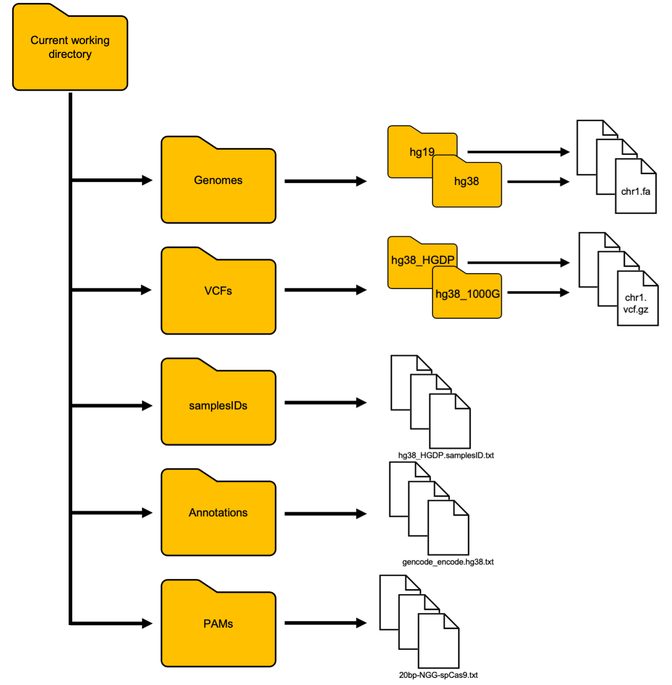

# CRISPRme

[](http://bioconda.github.io/recipes/crisprme/README.html)


CRISPRme is a comprehensive tool designed for thorough off-target assessment in CRISPR-Cas systems. Available as a web application ([http://crisprme.di.univr.it/](http://crisprme.di.univr.it/)), offline tool, and command-line interface, it integrates human genetic variant datasets with orthogonal genomic annotations to predict and prioritize potential off-target sites at scale. CRISPRme accounts for single-nucleotide variants (SNVs) and indels, considers *bona fide* haplotypes, and allows for spacer:protospacer mismatches and bulges, making it well-suited for both population-wide and personal genome analyses. CRISPRme automates the entire workflow, from data download to executing the search, and delivers detailed reports complete with tables and figures through an interactive web-based interface.

## Installation

The following section provides instructions for installing CRISPRme. Depending on your operating system, you can install CRISPRme using one of the following methods:
- [`Conda`/`Mamba` (for Linux users)](#install-crisprme-via-condamamba-for-linux-users)
- [`Docker` (compatible with all operating systems, including macOS and Windows)](#install-crisprme-via-docker-compatible-with-all-operating-systems-including-macos-and-windows)

### Install CRISPRme via `Conda`/`Mamba` (for Linux users)

This section is divided into three subsections:
- [Installing `Conda` or `Mamba`](#installing-conda-or-mamba-distributions): This subsection provides the steps required to install `Conda` or `Mamba`. If these tools are not yet installed on your machine, start here.

- [Installing CRISPRme](#create-crisprmes-conda-environment): This subsection explains how to install CRISPRme using `Conda` or `Mamba`. If you already have `Conda` or `Mamba` installed, you can skip to the next section.

- [Updating CRISPRme](#updating-crisprmes-conda-installation): This final subsection details how to update older CRISPRme distributions installed via `Conda` or `Mamba` to the latest version.

#### Installing Conda or Mamba distributions

Before installing CRISPRme, you need to have either `Conda` or `Mamba` installed on your machine. Following the recommendations of the Bioconda community, we strongly recommend using `Mamba` over `Conda`. `Mamba` is a faster drop-in replacement to `Conda`, featuring a more efficient dependency-solving library and optimized components written in C++.

To install Conda, follow the official installation guide [here](https://docs.conda.io/projects/conda/en/latest/user-guide/install/index.html).

To install Mamba, follow the official installation guide [here](https://mamba.readthedocs.io/en/latest/installation/mamba-installation.html).

Once `Mamba` is installed, set up Bioconda with the following one-time configuration commands:
```
mamba config --add channels bioconda
mamba config --add channels defaults
mamba config --add channels conda-forge
mamba config --set channel_priority strict
```

If using `Conda` just replace `mamba` with `conda` in the above commands.

#### Create CRISPRme's conda environment

We reccomend using `Mamba` to create CRISPRme's `conda` environment. If you prefer to use `Conda`, simply replace `mamba` with `conda` in all the following commands.

To build CRISPRme's environment, open a terminal window and type:
```
mamba create -n crisprme python=3.9 crisprme -y  # install crisprme and deps
```
This command installs CRISPRme and all the required dependencies within a dedicated `conda` environment.

To activate the environmment, type:
```
mamba activate crisprme  # enable crisprme environment
```

To quickly test CRISPRme's installation, type in your terminal:
```
crisprme.py --version  # 2.1.5
crisprme.py
```

The first command should display the installed CRISPRme's version. If the second command lists CRISPRme's functionalities, the installation was successful, and CRISPRme is ready to use.

#### Updating CRISPRme's conda installation

To update an existing CRISPRme's installation via `Conda` or `Mamba`, use the following command:
```
mamba install crisprme==<latest_version>
```
For example, to update to version `2.1.5`:
```
mamba install crisprme==2.1.5
```
You can find the latest release version at the top of our [README](#crisprme).

### Install CRISPRme via Docker (compatible with all operating systems, including macOS and Windows)

This section is divided into two subsections:
- [Installing `Docker`](#install-docker): This subsection provides details on how to install `Docker` on your machine.

- [Building CRISPRme's `Docker`](#build-and-pull-crisprme-docker-image) image: This subsection guides you through building and pulling CRISPRme's Docker image

#### Install Docker 

MacOS and Windows users are encouraged to install [Docker](https://www.docker.com/get-started) to use CRISPRme. Linux users may also consider using Docker to run CRISPRme. 

Docker provides different distributions depending on your operating system. Follow the official Docker installation guide for your OS:
- [MacOS](https://docs.docker.com/docker-for-mac/install/) 

- [Windows](https://docs.docker.com/docker-for-windows/install/)

- [Linux](https://docs.docker.com/engine/install/ubuntu/)

**The following steps apply only for Linux users**<br>

To test your Docker installation, open a terminal window and type:
```
sudo docker run hello-world
```

If Docker is correctly installed, you should see a message like this:
```
Hello from Docker!
This message shows that your installation appears to be working correctly.

To generate this message, Docker took the following steps:
 1. The Docker client contacted the Docker daemon.
 2. The Docker daemon pulled the "hello-world" image from the Docker Hub.
    (amd64)
 3. The Docker daemon created a new container from that image which runs the
    executable that produces the output you are currently reading.
 4. The Docker daemon streamed that output to the Docker client, which sent it
    to your terminal.

To try something more ambitious, you can run an Ubuntu container with:
 $ docker run -it ubuntu bash

Share images, automate workflows, and more with a free Docker ID:
 https://hub.docker.com/

For more examples and ideas, visit:
 https://docs.docker.com/get-started/
```

To complete Docker set up on Linux, follow these additional steps: 
1) Create a Docker group by typing:
```
sudo groupadd docker
```

2) Add the current user to the Docker group:
```
sudo usermod -aG docker $USER
```
Repeat this command for any other user you want to add to the Docker group (**Note:** on most system you must have `sudo` privileges to do this).

3) Restart your machine or log out and back in to apply the changes.

To verify that the Docker group configured correctly, open a new terminal window and run:
```
docker run hello-world
```

If you see the "hello from Docker!" message, Docker has been suceesfully installed and properly configured on your machine.

#### Build and Pull CRISPRme docker image

Once Docker is installed, open a new terminal window and run the following command:
```
docker pull pinellolab/crisprme
```

This command will download and build the CRISPRme Docker image on your machine.

## Usage

CRISPRme offers a range of functionalities for efficient variant- and haplotype-aware CRISPR off-target searches, along with tools for further analysis of the results. Additionally, it provides a graphical interface that can be deployed locally to simplify usage.

### System requirements

CRISPRme typically requires at least 32 GB of available memory (RAM) for most cases. However, for intensive searches involving complete genomes and large variant datasets, more memory may be necessary. In such cases, we recommend ensuring that the system running CRISPRme has **at least 64 GB of memory available**.

### CRISPRme directory structure

CRISPRme is designed to work within a specific directory tree structure in the current working directory. The tool requires five main directories to be properly organized for it to run correctly:

- **Genomes**: This directory contains subdirectories, each holding the reference genome to be used. Reference genomes must be split by chromosome, with each chromosome sequence in a separate FASTA file.

- **VCFs**: This directory contains subdirectories, each holding the VCF files, which should be compressed using `bgzip` (with a `.gz` extension). Similar to the Genomes directory, VCF files must be split by chromosome, with one VCF file per chromosome.

- **sampleIDs**: This directory contains tab-separated files listing the samples for each VCF dataset.

- **Annotation**: This directory contains annotation files in BED format.

- **PAMs**: This directory contains text files specifying the PAM sequences.

The image below provides a visual representation of the directory structure required by CRISPRme:


### CRISPRme functionalities

This section provides an overview of CRISPRme's core functionalities, including descriptions of each feature, the required input data and formats, and the resulting output data. Below is a list of CRISPRme's key functionalities:

- [**complete-search**](#complete-search): Conducts a comprehensive search across the entire genome (both reference and variant data, if requested), performs Cutting Frequency Determination (CFD) analysis, and selects targets.

- [**complete-test**](#complete-test): Tests the full CRISPRme pipeline using a small input dataset, allowing you to verify the tool's functionality before running larger analyses.

- [**targets-integration**](#targets-integration): Integrates in-silico predicted targets with empirical data to generate a usable target panel.

- [**gnomAD-converter**](#gnomad-converter): Converts gnomAD v3.1 vcf.bgz files into a format compatible with CRISPRme.

- [**generate-personal-card**](#generate-personal-card): Generates a personalized card for a specific sample, extracting all private off-targets unique to that individual.

- [**web-interface**](#web-interface): Activates CRISPRme's web interface, allowing you to interact with the tool through a browser locally.

#### Complete-search

The `complete-search` functionality executes a comprehensive variant- and haplotype-aware off-target analysis on the provided reference genome and variant datasets. This function processes all steps in CRISPRme's pipeline, including off-target identification, annotation, and reporting. It generates detailed reports on population- and sample-specific off-targets, as well as graphical summaries of the findings. This section describes the input parameters, output data, and provides a usage example.

##### Input arguments

Below the list and description of the input arguments required by `complete-search` function:

- **--help**: Displays the help message and exits.

- **--genome**: Specifies the directory containing the reference genome in FASTA format. The genome should be divided into individual chromosome files (e.g., `chr1.fa`, `chr2.fa`, etc.).

- **--vcf**: ext file specifying the subdirectories containing the VCFs used to enrich the input reference genome. If not specified, CRISPRme searches off-targets only on the reference genome sequence. [OPTIONAL]

- **--guide**: Text file containing a list of guide sequences (one per row) to search within the input data. This option is mutually exclusive with the `--sequence` argument.

- **--sequence**: Text file listing guide sequences formatted as a FASTA file. This option cannot be used in conjunction with `--guide`.

- **--pam**: Text file containing the PAM sequence to be used in the search.

- **--be-window**: Specifies the base editor window, requiring start and stop coordinates (1-based, with respect to the target start), separated by a comma. This option is used to search for susceptibility to base editing. [OPTIONAL]

- **--be-base**: Specifies the base editor nucleotide(s) to check for the chosen editor. [OPTIONAL]

- **--annotation**: BED file containing annotation data, such as a list of genetic regions with associated functions (e.g., DNase hypersensitive sites, enhancers, etc.).

- **--samplesID**: Text file containing a list of sample IDs (one per line) corresponding to the VCF datasets used. These files must be located within the sampleID directory. This option is mandatory if `--vcf` is specified. [OPTIONAL]

- **--gene_annotation**: BED file containing gene data, such as Gencode annotations, used to compute gene proximity for the identified targets.

- **--mm**: Maximum number of mismatches allowed during the target search.

- **--bDNA**: Maximum bulge size allowed on DNA.

- **--bRNA**: Maximum bulge size allowed on RNA.

- **--merge**: Specifies the window size (in base pairs) used to merge candidate off-targets. When merging, the pivot targets are selected based on the highest score, particularly when CFD and CRISTA scores are computed, using the criteria defined by the `--sorting-criteria-scoring` argument. If CFD and CRISTA scores are not available, the merging follows the criteria specified in `--sorting-criteria`. The default window size for merging is set to 3 base pairs. [OPTIONAL]

- **--sorting-criteria-scoring**: Defines the criteria for sorting and merging targets based on CFD/CRISTA scores, prioritizing the highest score. The criteria must be provided as a comma-separated list. Available options include `mm` (number of mismatches), `bulges` (bulge size), and `mm+bulges` (total number of mismatches and bulges). By default, `mm+bulges` is used as the sorting criterion. [OPTIONAL]

- **--sorting-criteria**: Specifies the criteria for sorting and merging targets based on the fewest mismatches and bulges, particularly when CFD and CRISTA scores cannot be computed. The criteria should be provided as a comma-separated list. Available options include `mm` (number of mismatches), `bulges` (bulge size), and `mm+bulges` (total mismatches and bulges). By default, the tool uses `mm+bulges` as the primary criterion and `mm` as a secondary criterion, with `mm+bulges` serving as the main pivot for merging. [OPTIONAL]

- **--output**: Name of the output directory, which will contain all the results of CRISPRme's analysis. This directory will be located within the `Results` directory.

- **--thread**: Number of threads to use during the computation. By default, CRISPRme uses 4 threads. [OPTIONAL]

- **debug**: Runs the tool in debug mode. [OPTIONAL]

##### Output data

The `complete-search` functionality generates various reports detailing the targets identified and prioritized by CRISPRme, along with statistical summaries of these targets categorized by sample or input guide. Additionally, CRISPRme provides graphical summaries of the search results and statistics in image format.

Below is a description of the contents of each output file:

-**`*.bestMerge.txt`**: This file contains the top targets selected based on the input criteria. Each row represents the best target for a specific genomic location, chosen according to the highest CFD score (if computed), highest CRISTA score (if computed), and the fewest combined mismatches and bulges.

- **`*.altMerge.txt`**: This file includes all alternative alignments that were not selected for the `*.bestMerge.txt` file. It lists all additional targets identified by CRISPRme at each candidate off-target position. Each genomic position may have multiple reported targets in this file.

- **`*.integrated_results.tsv`**: This file details the best targets according to the input criteria, along with annotation data from the input files. It includes information on the gene proximity of each candidate off-target and its location within regulatory elements.

- **`*.all_results_with_alternative_alignments.tsv`**: This file lists all targets identified by CRISPRme, including alternative alignments at potential off-target sites. Each reported target is annotated with gene proximity and its location within functional genomic regulatory elements, based on the input annotation files.

- **`*.summary_by_guide.<guide-sequence>_CFD.txt`**: This file summarizes the number of candidate off-targets identified by CRISPRme for each guide, using the CFD score as the primary sorting criterion. It provides counts of targets based on bulge type, mismatch number, and bulge size, as well as how many targets were found in the reference sequence, variant genome, and how many were a result of PAM creation due to a variant. These counts are derived from the targets listed in the `*.bestMerge.txt` file.

- **`*.summary_by_guide.<guide-sequence>_CRISTA.txt`**: This file provides a summary similar to the `*_CFD.txt` file, but uses the CRISTA score as the primary sorting criterion. It details the number of candidate off-targets per guide, categorized by bulge type, mismatch number, bulge size, and the presence of targets in the reference sequence, variant genome, and those resulting from PAM creation due to a variant.

- **`*.summary_by_guide.<guide-sequence>_fewest.txt`**: This file summarizes the number of candidate off-targets identified by CRISPRme for each guide, using the fewest combined mismatches and bulge size as the primary sorting criterion. It provides counts based on bulge type, mismatch number, and bulge size, and notes how many targets were found in the reference sequence, variant genome, and those due to PAM creation by a variant.

- **`*.summary_by_samples.<guide-sequence>_CFD.txt`**: This file counts the candidate off-targets identified by CRISPRme that are private to each sample, using the CFD score as the primary sorting criterion. It also reports how many targets were found in the sample’s population and superpopulation, and how many involved PAM creation induced by a variant.

- **`*.summary_by_samples.<guide-sequence>_CRISTA.txt`**: Similar to the `*_CFD.txt` file, this file counts private candidate off-targets for each sample, using the CRISTA score as the primary sorting criterion. It also provides details on targets found in the population, superpopulation, and those involving PAM creation due to a variant.

- **`*.summary_by_samples.<guide-sequence>_fewest.txt`**: This file summarizes the candidate off-targets identified by CRISPRme that are private to each sample, sorted by the fewest combined mismatches and bulge size. It includes counts of targets found in the sample’s population and superpopulation, as well as those involving PAM creation due to a variant.

- **`imgs` directory**: This directory contains images that illustrate the impact of genetic variants on the top 1000 targets, selected according to each of the previously mentioned criteria (CFD score, CRISTA score, and the combined number of mismatches and bulge size). The images depict changes in these metrics due to genetic variations. Additionally, the directory includes bar plots that show the distribution of targets across different populations, categorized by the combined number of mismatches and bulge size identified by CRISPRme.

##### Usage example

Usage example of `complete-search` function:

- Via `conda`/`mamba`:
  ```
  crisprme.py complete-search --genome Genomes/hg38/ --vcf vcf_list.txt/ --guide sg1617.txt --pam PAMs/20bp-NGG-spCas9.txt --annotation Annotations/dhs+gencode+encode.hg38.bed --samplesID samplesID_list.txt --be-window 4,8 --be-base A --gene_annotation Annotations/gencode.protein_coding.bed --bMax 2 --mm 6 --bDNA 2 --bRNA 2 --merge 3 --sorting-criteria-scoring mm+bulges --sorting-criteria mm+bulges,mm --output sg1617_NGG --thread 4
  ```

- Via `Docker`:
  ```
  docker run -v ${PWD}:/DATA -w /DATA -i pinellolab/crisprme crisprme.py complete-search --genome Genomes/hg38/ --vcf vcf_list.txt/ --guide sg1617.txt --pam ./PAMs/20bp-NGG-SpCas9.txt --annotation Annotations/dhs+encode+gencode.hg38.bed --samplesID samplesID_list.txt --be-window 4,8 --be-base A --gene_annotation Annotations/gencode.protein_coding.bed --bMax 2 --mm 6 --bDNA 2 --bRNA 2 --merge 3 --sorting-criteria-scoring mm+bulges --sorting-criteria mm+bulges,mm --output sg1617_NGG --thread 4
  ```

#### Complete-test

The `complete-test` feature offers a fully automated pipeline for testing CRISPRme's installation. It handles the creation of the CRISPRme directory structure and downloads the essential files required to run the tool. `Complete-test` provides several testing options, allowing the user to perform quick tests on a single chromosome or conduct comprehensive tests on the entire genome. Furthermore, the feature supports testing CRISPRme using either the 1000 Genomes Phase 3 dataset or the Human Genome Diversity Project (HGDP) dataset. The testing environment can be configured by the user via command line parameters.

The necessary data for these tests can be accessed [here](https://github.com/pinellolab/CRISPRme/tree/gnomad-4.1-converter/test/data), except for the FASTA and VCF files, which are downloaded from the UCSC and 1000 Genomes/HGDP databases due to their large file sizes.

##### Input arguments

Below the list and description of the input arguments required by `complete-test` function:

- **--help**: Displays the help message and exits.

- **--chrom**: Specifies the chromosome for CRISPRme's test. The chromosome number must be prefixed with chr (e.g., chr22). By default, the test is conducted on the entire genome. [OPTIONAL]

- **--vcf_dataset**: Defines the variant dataset used for testing CRISPRme. The available options are `1000G` for the 1000 Genomes dataset and `HGDP` for the Human Genome Diversity Project dataset. The default dataset is 1000 Genomes. [OPTIONAL]

- **--debug**: Runs the tool in debug mode. [OPTIONAL]

##### Output data


##### Usage example

Usage example of `complete-test` function:

- Via `conda`/`mamba`:
```
# test only on chr 22 and 1000 Genomes
crisprme.py complete-test --chrom chr22 --vcf_dataset 1000G

# test on the entire genome and HGDP 
crisprme.py complete-test --vcf_dataset HGDP
```

- Via `Docker`:
```
# test only on chr 22 and 1000 Genomes
docker run -v ${PWD}:/DATA -w /DATA -i pinellolab/crisprme crisprme.py complete-test --chrom chr22 --vcf_dataset 1000G

# test on the entire genome and HGDP 
docker run -v ${PWD}:/DATA -w /DATA -i pinellolab/crisprme crisprme.py complete-test --vcf_dataset HGDP
```

#### Targets-integration

The `targets-integration` feature combines the targets identified by CRISPRme with empirically validated targets, such as those obtained through GUIDE-seq or CIRCLE-seq. The empirically validated targets should be provided in a `BED` file. After integrating the two datasets, this feature generates an `integrated_result` file within the specified output directory.

##### Input arguments

Below the list and description of the input arguments required by `targets-integration` function:

- **--help**: Displays the help message and exits.

- **--targets**: File containing the targets identified and processed from a CRISPRme search.

- **--empirical_data**: `BED` file with empirically verified off-targets, such as those obtained from GUIDE-seq, CIRCLE-seq, or other sequencing protocols.

- **--output**: NName of the output directory where the integrated targets file will be saved.

- **--debug**: Runs the tool in debug mode. [OPTIONAL]

##### Output data

##### Usage example

Usage example of `targets-integration` function:

- Via `conda`/`mamba`:
  ```
  crisprme.py targets-integration --targets results.integrated_results.tsv --empirical_data empirical_data.bed --output integrated_targets_dir
  ```

- Via `Docker`:
  ```
  docker run -v ${PWD}:/DATA -w /DATA -i i pinellolab/crisprme crisprme.py targets-integration --targets results.integrated_results.tsv --empirical_data empirical_data.bed --output integrated_targets_dir
  ```

#### gnomAD-converter 

The `gnomAD-converter` function provides a utility to convert gnomAD VCF files into a format suitable for use as input in CRISPRme searches. The converter currently supports gnomAD VCF files for the following versions:

- v3.1

- v4.0

- v4.1 (including joint VCFs)

For a successful conversion, the converter requires a sample ID file. Since individual samples are not provided in gnomAD VCFs, CRISPRme treats populations as single samples. This approach does not impact population-based statistics. However, if you require sample-specific statistics, we do not recommend using gnomAD, as the data are population-based rather than sample-based. Sample ID files for gnomAD [v3.1 and v4.0](https://github.com/pinellolab/CRISPRme/blob/gnomad-4.1-converter/test/data/hg38_gnomAD.samplesID.txt) and [v4.1](https://github.com/pinellolab/CRISPRme/blob/gnomad-4.1-converter/test/data/hg38_gnomAD.v4.1.samplesID.txt) are available on our GitHub page.

##### Input arguments

Below the list and description of the input arguments required by `targets-integration` function:

- **--help**: Displays the help message and exits.

- **--gnomAD_VCFdir**: Directory containing the gnomAD VCF files to process and convert into a format suitable for CRISPRme.

- **--samplesID**: Text file containing the sample IDs used during the gnomAD VCF conversion. In this file, gnomAD populations are treated as individual samples to construct VCFs suitable for CRISPRme.

- **--joint**: Flag specifying whether the gnomAD VCFs to convert are joint VCFs. By default the converter assumes the input VCFs are not joint VCFs [OPTIONAL]

- **--keep**: Flag specifying whether to retain all variants, regardless of their value in the FILTER field of the VCF. By default, the converter discards variants without a PASS value in the FILTER field. [OPTIONAL]

- **--multiallelic**: Flag indicating whether to merge variants mapped at the same position into a single line, creating multiallelic entries. By default, the converter keeps all variants biallelic and does not merge them. [OPTIONAL]

- **--thread**: Specifies the number of threads to use during the computation. By default, CRISPRme uses 4 threads. [OPTIONAL]

- **--debug**: Runs the tool in debug mode. [OPTIONAL]

##### Output data

##### Usage example

Usage example of `targets-integration` function:

- Via `conda`/`mamba`:
  ```
  # keep all variants and merge variants in multiallelic variants
  crisprme.py gnomAD-converter --gnomAD_VCFdir gnomad_vcf_dir --samplesID hg38_gnomAD.samplesID.txt --keep --multiallelic -thread 4
  ```

- Via `Docker`:
  ```
  # keep all variants and merge variants in multiallelic variants
  docker run -v ${PWD}:/DATA -w /DATA -i i pinellolab/crisprme crisprme.py gnomAD-converter --gnomAD_VCFdir gnomad_vcf_dir --samplesID hg38_gnomAD.samplesID.txt --keep --multiallelic -thread 4
  ```

#### Generate-personal-card

The `generate-personal-card` functionality generates a sample-specific report. This report, called personal card, contains all targets found by CRISPRme on the sample-specific genomic sequence, accounting for its private variants. This functionality is useful when searching private potential off-target sequences for a certain input guide.

##### Input arguments 

Below the list and description of the input arguments required by `generate-personal-card` function:

- **--help**: Displays the help message and exits.

- **--result_dir**: Directory containing the CRISPRme search results. Targets are extracted from the targets reports available in the input directory.

- **--guide_seq**: sequence of the guide of interest to use to extract the sample-specific targets from the input data

- **--sample_id**: ID of the sample to use to generate the personal card

- **--debug**: Runs the tool in debug mode.

##### Output data
- Set of plots generated with personal and private targets containing the variant CFD score and the reference CFD score
- Filtered file with private targets of the sample directly extracted from integrated file

##### Usage example

Usage example of `generate-personal-card` function:

- Via `conda`/`mamba`:
  ```
  crisprme.py generate-personal-card --result_dir Results/sg1617.6.2.2 --guide_seq CTAACAGTTGCTTTTATCACNNN --sample_id NA21129
  ```

- Via `Docker`:
  ```
  docker run -v ${PWD}:/DATA -w /DATA -i i pinellolab/crisprme crisprme.py generate-personal-card --result_dir Results/sg1617.6.2.2/ --guide_seq CTAACAGTTGCTTTTATCACNNN --sample_id NA21129
  ```

#### Web-interface

The `web-interface` deploys locally a graphical user interface similar to crisprme's website. This local server can be accessed using the major web-browser used (successfully tested on Chrome, Safari, and Firefox). The graphical interface provides an easy-to-use interface to run CRISPRme and explore the search results interactively. 

Note that this functionality is currently available only for CRISPRme distributions installed via `conda`/`mamba`.

##### Input arguments

Below the list and description of the input arguments required by `web-interface` function:

- **--debug**: Deploys the local server in debug mode.

##### Output data

This function does not produce output data.

##### Usage example

Usage example of `web-interface` function:

- Via `conda`/`mamba`:
  ```
  crisprme.py web-interface  # starts local server
  ```

## Test

To test CRISPRme installation, open a new terminal window and type:
```
wget https://www.dropbox.com/s/urciozkana5md0z/crisprme_test.tar.gz?dl=1 -O crisprme_test.tar.gz
tar -xvf crisprme_test.tar.gz
```
This will download a folder containing some test data, to run and test CRISPRme.

Once downloaded, enter the folder by typing:
```
cd crisprme_test
```

If you installed CRISPRme via ```conda```, test your conda installation by typing:
```
bash crisprme_auto_test_conda.sh
```

Otherwise, if you installed CRISPRme via Docker, test your Docker installation by typing:
```
bash crisprme_auto_test_docker.sh
```

After starting, the tests will download the required test data, then CRISPRme will start its analysis.
**NB** Depending on your hardware the test may take very different time to complete.

Once downloaded and untared the folder, you will have a ready to use CRISPRme directory tree.
**NB  DO NOT CHANGE ANY FOLDER NAME** to avoid losing data or forcing to recompute indexes and dictionaries. **YOU MUST USE THE DEFAULT FOLDERS TO STORE THE DATA** since the software have been designed to recognize only files and folders in its own folder tree (see **Usage** section).

## Citation
If you use CRISPRme in your research, please cite our [paper](https://rdcu.be/c1GYQ):

Cancellieri S, Zeng J, Lin LY, Tognon M, Nguyen MA, Lin J, Bombieri N, Maitland SA, Ciuculescu MF, Katta V, Tsai SQ, Armant M, Wolfe SA, Giugno R, Bauer DE, Pinello L. Human genetic diversity alters off-target outcomes of therapeutic gene editing. Nat Genet. 2023 Jan;55(1):34-43. doi: [10.1038/s41588-022-01257-y](https://doi.org/10.1038/s41588-022-01257-y). Epub 2022 Dec 15. PMID: 36522432; PMCID: PMC10272994.

## Contacts

Luca Pinello: lpinello@mgh.harvard.edu<br>
Rosalba Giugno: rosalba.giugno@univr.it<br>
Daniel Bauer: bauer@bloodgroup.tch.harvard.edu

## License

CRISPRme is licensed under AGPL-3.0, allowing use for academic research only.

For-profit institutions must purchase a license before using CRISPRme. For more information, please contact lpinello@mgh.harvard.edu.
