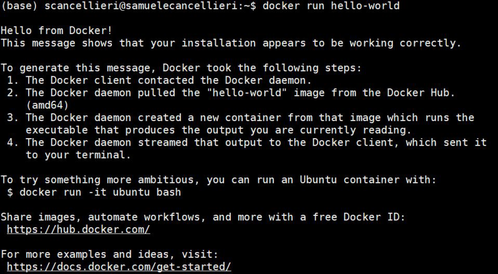
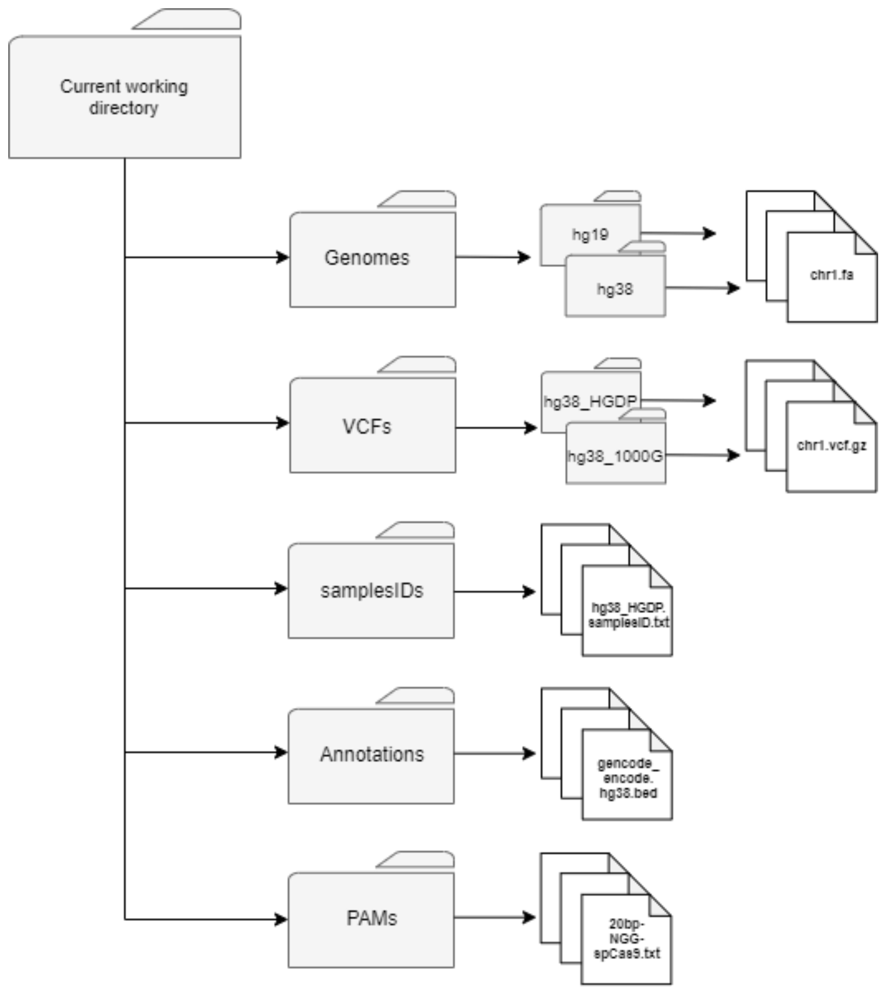

# CRISPRme

[](http://bioconda.github.io/recipes/crisprme/README.html)


CRISPRme is a comprehensive tool designed for thorough off-target assessment in CRISPR-Cas systems. Available as a web application ([http://crisprme.di.univr.it/](http://crisprme.di.univr.it/)), offline tool, and command-line interface, it integrates human genetic variant datasets with orthogonal genomic annotations to predict and prioritize potential off-target sites at scale. CRISPRme accounts for single-nucleotide variants (SNVs) and indels, considers *bona fide* haplotypes, and allows for spacer:protospacer mismatches and bulges, making it well-suited for both population-wide and personal genome analyses. CRISPRme automates the entire workflow, from data download to executing the search, and delivers detailed reports complete with tables and figures through an interactive web-based interface.

## Installation
The following section provides instructions for installing CRISPRme. Depending on your operating system, you can install CRISPRme using one of the following methods:
- [`Conda`/`Mamba` (for Linux users)](#install-crisprme-via-condamamba-for-linux-users)
- [`Docker` (compatible with all operating systems, including macOS and Windows)](#install-crisprme-via-docker-compatible-with-all-operating-systems-including-macos-and-windows)

### Install CRISPRme via `Conda`/`Mamba` (for Linux users)
This section is divided into three subsections:
- [Installing `Conda` or `Mamba`](#installing-conda-or-mamba-distributions): This subsection provides the steps required to install ```Conda``` or ```Mamba```. If these tools are not yet installed on your machine, start here.

- [Installing CRISPRme](#create-crisprmes-conda-environment): This subsection explains how to install CRISPRme using ```Conda``` or ```Mamba```. If you already have ```Conda``` or ```Mamba``` installed, you can skip to the next section.

- [Updating CRISPRme](#updating-crisprmes-conda-installation): This final subsection details how to update older CRISPRme distributions installed via ```Conda``` or ```Mamba``` to the latest version.

#### Installing Conda or Mamba distributions
Before installing CRISPRme, you need to have either ```Conda``` or ```Mamba``` installed on your machine. Following the recommendations of the Bioconda community, we strongly recommend using ```Mamba``` over ```Conda```. ```Mamba``` is a faster drop-in replacement to ```Conda```, featuring a more efficient dependency-solving library and optimized components written in C++.

To install Conda, follow the official installation guide [here](https://docs.conda.io/projects/conda/en/latest/user-guide/install/index.html).

To install Mamba, follow the official installation guide [here](https://mamba.readthedocs.io/en/latest/installation/mamba-installation.html).

Once ```Mamba``` is installed, set up Bioconda with the following one-time configuration commands:
```
mamba config --add channels bioconda
mamba config --add channels defaults
mamba config --add channels conda-forge
mamba config --set channel_priority strict
```

If using ```Conda``` just replace ```mamba``` with ```conda``` in the above commands.

#### Create CRISPRme's conda environment
We reccomend using ```Mamba``` to create CRISPRme's ```conda``` environment. If you prefer to use ```Conda```, simply replace ```mamba``` with ```conda``` in all the following commands.

To build CRISPRme's environment, open a terminal window and type:
```
mamba create -n crisprme python=3.9 crisprme -y  # install crisprme and deps
```
This command installs CRISPRme and all the required dependencies within a dedicated `conda` environment.

To activate the environmment, type:
```
mamba activate crisprme  # enable crisprme environment
```

To quickly test CRISPRme's installation, type in your terminal:
```
crisprme.py --version  # 2.1.5
crisprme.py
```

The first command should display the installed CRISPRme's version. If the second command lists CRISPRme's functionalities, the installation was successful, and CRISPRme is ready to use.

#### Updating CRISPRme's conda installation
To update an existing CRISPRme's installation via `Conda` or `Mamba`, use the following command:
```
mamba install crisprme==<latest_version>
```
For example, to update to version `2.1.5`:
```
mamba install crisprme==2.1.5
```
You can find the latest release version at the top of our [README](#crisprme).

### Install CRISPRme via Docker (compatible with all operating systems, including macOS and Windows)
This section is divided into two subsections:
- [Installing `Docker`](#install-docker): This subsection provides details on how to install `Docker` on your machine.

- [Building CRISPRme's `Docker`](#build-and-pull-crisprme-docker-image) image: This subsection guides you through building and pulling CRISPRme's Docker image

#### Install Docker 
MacOS and Windows users are encouraged to install [Docker](https://www.docker.com/get-started) to use CRISPRme. Linux users may also consider using Docker to run CRISPRme. 

Docker provides different distributions depending on your operating system. Follow the official Docker installation guide for your OS:
- [MacOS](https://docs.docker.com/docker-for-mac/install/) 

- [Windows](https://docs.docker.com/docker-for-windows/install/)

- [Linux](https://docs.docker.com/engine/install/ubuntu/)

**The following steps apply only for Linux users**<br>
To test your Docker installation, open a terminal window and type:
```
sudo docker run hello-world
```

If Docker is correctly installed, you should see a message like this:


To complete Docker set up on Linux, follow these additional steps: 
1) Create a Docker group by typing:
```
sudo groupadd docker
```

2) Add the current user to the Docker group:
```
sudo usermod -aG docker $USER
```
Repeat this command for any other user you want to add to the Docker group (**Note:** on most system you must have `sudo` privileges to do this).

3) Restart your machine or log out and back in to apply the changes.

To verify that the Docker group configured correctly, open a new terminal window and run:
```
docker run hello-world
```

If you see the "hello from Docker!" message, Docker has been suceesfully installed and properly configured on your machine.

#### Build and Pull CRISPRme docker image
Once Docker is installed, open a new terminal window and run the following command:
```
docker pull pinellolab/crisprme
```

This command will download and build the CRISPRme Docker image on your machine.

## Test CRISPRme
To test your CRISPRme installation, open a new terminal window and type:
```
wget https://www.dropbox.com/s/urciozkana5md0z/crisprme_test.tar.gz?dl=1 -O crisprme_test.tar.gz
tar -xvf crisprme_test.tar.gz
```
This will download a folder containing some test data, to run and test CRISPRme.

Once downloaded, enter the folder by typing:
```
cd crisprme_test
```

If you installed CRISPRme via ```conda```, test your conda installation by typing:
```
bash crisprme_auto_test_conda.sh
```

Otherwise, if you installed CRISPRme via Docker, test your Docker installation by typing:
```
bash crisprme_auto_test_docker.sh
```

After starting, the tests will download the required test data, then CRISPRme will start its analysis.
**NB** Depending on your hardware the test may take very different time to complete.

Once downloaded and untared the folder, you will have a ready to use CRISPRme directory tree.
**NB  DO NOT CHANGE ANY FOLDER NAME** to avoid losing data or forcing to recompute indexes and dictionaries. **YOU MUST USE THE DEFAULT FOLDERS TO STORE THE DATA** since the software have been designed to recognize only files and folders in its own folder tree (see **Usage** section).


## Usage
CRISPRme is designed to work and recognize its specific directories tree structure. See the following image for a detailed explanantion of CRISPRme's folders structure


<br>**CAVEAT.** Before running CRISPRme make sure that your system has **>= 64 GB of memory** available.

The following sections will describe the main functionalities of CRISPRme, listing their input data, and the expected output.

#### Complete-search function
```complete-search``` performs a complete search from scratch returing all the results and post-analysis data.

**Input**:
- Directory containing a reference genome (FASTA format). The reference genome must be separated into single chromosome files (e.g. chr1.fa, chr2.fa, etc.).
- Text file storing path to the VCF directories [OPTIONAL]
- Text file with a list of guides (1 to N)
- Text file with a single PAM sequence
- BED file with annotations, containing a list of genetic regions with a function associated
- Text file containing a list of path to a samplesID file (1 to N) equal to the number of VCF dataset used [OPTIONAL]
- Base editor window, used to specify the window to search for susceptibilty to certain base editor [OPTIONAL]
- Base editor nucleotide(s), used to specify the base(s) to check for the choosen editor [OPTIONAL]
- BED file extracted from Gencode data to find gene proximity of targets
- Maximal number of allowed bulges of any kind to compute in the index genome
- Threshold of mismatches allowed
- Size of DNA bulges allowed
- Size of RNA bulges allowed
- Merge range, necessary to reduce the inflation of targets due to bulges, it's the window of bp necessary to merge one target into another maintaining the highest scoring one
- Sorting criteria to use while merging targets based on CFD/CRISTA scores (scores have highest priority)
- Sorting criteria to use while merging targets based on fewest mismatches+bulges
- Output directory, in which all the data will be produced
- Number of threads to use in computation

**Output**
- bestMerge targets file, containing all the highest scoring targets, in terms of CFD and targets with the lowest combination of mismatches and bulges (with preference to lowest mismatches count), each genomic position is represent by one target
- altMerge targets file, containing all the discarded targets from the bestMerge file, each genomic position can be represented by more than target
- Parameters data file, containing all the parameters used in the search
- Count and distribution files, containing all the data count file useful in the web-tool representation to generate main tables and view
- Integrated results and database, containing all the tabulated data with genes proximity analysis and database representation to rapid querying on the web-tool GUI
- Directory with raw targets, containing the un-processed results from the search, useful to recover any possible target found during the search
- Directory with images, containing all the images generated to be used with the web-tool

**Example**
- via ```conda```:
  ```
  crisprme.py complete-search --genome Genomes/hg38/ --vcf list_vcf.txt/ --guide sg1617.txt --pam PAMs/20bp-NGG-spCas9.txt --annotation Annotations/gencode_encode.hg38.bed --samplesID list_samplesID.txt --be-window 4,8 --be-base A --gene_annotation Gencode/gencode.protein_coding.bed --bMax 2 --mm 6 --bDNA 2 --bRNA 2 --merge 3 --sorting-criteria-scoring mm+bulges --sorting-criteria mm+bulges,mm --output sg1617/ --thread 4
  ```
- via Docker:
  ```
  docker run -v ${PWD}:/DATA -w /DATA -i pinellolab/crisprme crisprme.py complete-search --genome Genomes/hg38/ --vcf list_vcf.txt/ --guide sg1617.txt --pam ./PAMs/20bp-NGG-SpCas9.txt --annotation ./Annotations/encode+gencode.hg38.bed --samplesID list_samplesID.txt --be-window 4,8 --be-base A --gene_annotation ./Annotations/gencode.protein_coding.bed --bMax 2 --mm 6 --bDNA 2 --bRNA 2 --merge 3 --output sg1617/ --thread 4
  ```

#### Targets-integration function
```targets-integration``` returns an ```integrated_result``` file with paired empirical targets from an ```integrated_results``` file.

**Input**
- Integrated results from a search, containing the processed targets
- BED file containing empirical verified OT, like via GUIDE-seq, CIRCLE-seq and other sequencing protocols
- Output directory, in which the integrated result file with empirical data will be created

**Output**
- Directory containing the integrated result with each target pair with an existing empirical target (if found)

**Example**
- via ```conda```:
  ```
  crisprme.py targets-integration --targets *integrated_results.tsv --empirical_data empirical_data.tsv --output dir/
  ```
- via Docker:
  ```
  docker run -v ${PWD}:/DATA -w /DATA -i i pinellolab/crisprme crisprme.py targets-integration --targets *integrated_results.tsv --empirical_data empirical_data.tsv --output dir/
  ```

#### gnomAD-converter function
```gnomAD-converter``` converts a set of gnomADv3.1 VCFs into compatible VCFs.

**Input**
- gnomAD_VCFdir, used to specify the directory containing gnomADv3.1 original VCFs
- samplesID, used to specify the pre-generated samplesID file necessary to introduce samples into gnomAD variant
- thread, the number of threads used in the process (default is ALL available minus 2)

**Output**
- original gnomAD directory with the full set of gnomAD VCFs converted to compatible format

**Example**
- via ```conda```:
  ```
  crisprme.py gnomAD-converter --gnomAD_VCFdir gnomad_dir/ --samplesID samplesIDs/hg38_gnomAD.samplesID.txt -thread 4
  ```
- via Docker:
  ```
  docker run -v ${PWD}:/DATA -w /DATA -i i pinellolab/crisprme crisprme.py gnomAD-converter --gnomAD_VCFdir gnomad_dir/ --samplesID samplesIDs/hg38_gnomAD.samplesID.txt -thread 4
  ```

#### Generate-personal-card function
```generate-personal-card``` generates a personal card for a specified input sample.

**Input**
- result_dir, directory containing the result from which extract the targets to generate the card
- guide_seq, sequence of the guide to use in order to exctract the targets
- sample_id, ID of the sample to use in order to generate the card

**Output**
- Set of plots generated with personal and private targets containing the variant CFD score and the reference CFD score
- Filtered file with private targets of the sample directly extracted from integrated file

**Example**
- via ```conda```:
  ```
  crisprme.py generate-personal-card --result_dir Results/sg1617.6.2.2/ --guide_seq CTAACAGTTGCTTTTATCACNNN --sample_id NA21129
  ```
- via Docker
  ```
  docker run -v ${PWD}:/DATA -w /DATA -i i pinellolab/crisprme crisprme.py generate-personal-card --result_dir Results/sg1617.6.2.2/ --guide_seq CTAACAGTTGCTTTTATCACNNN --sample_id NA21129
  ```

#### Web-interface function (only via conda)
```web-interface``` starts a local server to use CRISPRme's web interface.

**Example**
- via ```conda```
  ```
  crisprme.py web-interface
  ```

## Citation
If you use CRISPRme in your research, please cite our paper [(shareable link to full text)](https://rdcu.be/c1GYQ):

Cancellieri S, Zeng J, Lin LY, Tognon M, Nguyen MA, Lin J, Bombieri N, Maitland SA, Ciuculescu MF, Katta V, Tsai SQ, Armant M, Wolfe SA, Giugno R, Bauer DE, Pinello L. Human genetic diversity alters off-target outcomes of therapeutic gene editing. Nat Genet. 2023 Jan;55(1):34-43. doi: [10.1038/s41588-022-01257-y](https://doi.org/10.1038/s41588-022-01257-y). Epub 2022 Dec 15. PMID: 36522432; PMCID: PMC10272994.

## License

CRISPRme is licensed under AGPL-3.0, allowing use for academic research only.

For-profit institutions must purchase a license before using CRISPRme. For more information, please contact lpinello@mgh.harvard.edu.
